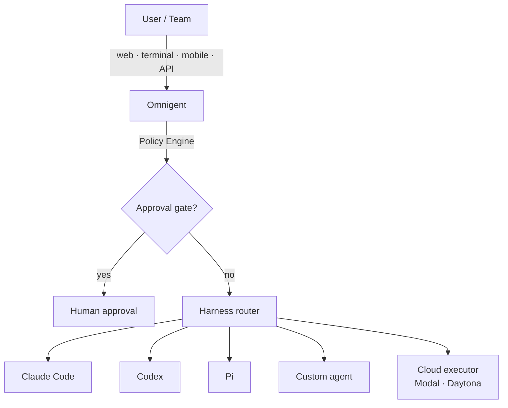

# Tools — 2026-06-14

## Databricks Omnigent: open-source meta-harness for AI agents 

**Source:** [Databricks Blog](https://www.databricks.com/blog/introducing-omnigent-meta-harness-combine-control-and-share-your-agents) · [MarkTechPost](https://www.marktechpost.com/2026/06/13/databricks-open-sources-omnigent-a-meta-harness-that-composes-governs-and-shares-ai-agents-across-claude-code-codex-and-pi/) · **Type:** release · **Time (UTC):** Jun 13

Databricks released Omnigent in alpha under Apache 2.0. It sits one abstraction level above existing agent harnesses — Claude Code, Codex, Pi, and custom agents — and exposes a single interface for composing, governing, and collaborating on agent sessions. Key features: a unified terminal/web/mobile/API surface that can swap the underlying harness without changing user tooling; real-time session sharing via URL so teammates can view, comment, or issue commands to a live agent run; contextual security policies that trigger approval gates based on session state (e.g., pause after a package install); per-session LLM cost caps; OS sandbox with network request interception; and cloud execution on Modal and Daytona. Code and quickstart guide are at [github.com/omnigent-ai/omnigent](https://github.com/omnigent-ai/omnigent).

**Why it matters:** The common complaint with agentic tooling is silo fragmentation — different harnesses, incompatible interfaces, manual copy-paste between sessions. Omnigent is the first production-quality open-source attempt to solve that with a harness-agnostic control plane. The policy layer addresses a practical security gap: today there is no standard way to impose spending or permission boundaries across agent harnesses without patching each one individually.

---
