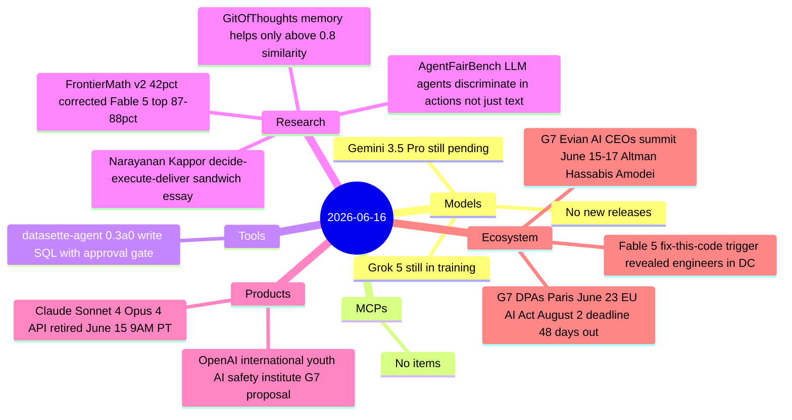

# AI Digest — 2026-06-16

> The Fable 5 export ban deepens from geopolitical dispute to direct public confrontation: Fortune revealed the "jailbreak" was simply asking the model to fix code with known vulnerabilities — routine defensive security work — while Anthropic dispatched senior engineers to Washington and The Atlantic reported the White House is "ratcheting up its war against Anthropic." The G7 Évian summit opened (June 15–17) with all three frontier AI lab CEOs in attendance for the first time; OpenAI formally proposed a nine-principle international youth AI safety institute backed by mandatory age estimation and annual risk assessments. On the operational side, Claude Sonnet 4 and Opus 4 API endpoints returned errors starting 09:00 PT on June 15 — any production app still on pinned version identifiers is now broken.

## Day at a glance



## Top stories

1. **Fable 5 export ban: "fix this code" trigger revealed, Anthropic engineers in DC** — Fortune reported the trigger for the US export-control directive was a user asking Fable to fix code with known vulnerabilities — standard defensive security work. Kate Moussouris published an open letter defending the capability; Anthropic sent engineers to Washington; The Atlantic reports an escalating White House confrontation over AI governance. [→ details](ecosystem.md#fable5-escalation)
2. **G7 Évian opens with all three AI lab CEOs and OpenAI's youth safety proposal** — First G7 with Altman, Hassabis, and Amodei attending; OpenAI proposed a nine-principle international youth AI safety institute with mandatory age estimation, annual risk assessments, and independent audits, timed explicitly for the summit. [→ details](ecosystem.md#g7-evian)
3. **Claude Sonnet 4 + Opus 4 APIs retired** — `claude-sonnet-4-0` and `claude-opus-4-0` now return errors; no grace period; un-migrated production apps are broken today. [→ details](products.md#claude-4-deprecation)

## By the numbers

| Category   | Items | Highlight |
|------------|------:|-----------|
| Models     |     0 | Gemini 3.5 Pro and Grok 5 still pending |
| MCPs       |     0 | — |
| Tools      |     1 | datasette-agent 0.3a0: write SQL approval gate |
| Research   |     4 | GitOfThoughts: memory only helps past 0.8 similarity threshold |
| Products   |     2 | Claude Sonnet/Opus 4 retire; OpenAI youth safety institute proposed |
| Ecosystem  |     3 | Fable 5 "fix this code"; G7 Évian; G7 DPAs Paris coordination |

## Timeline (UTC)

```mermaid
timeline
  title Releases and announcements
  Jun 12 : FrontierMath v2 released 42pct of problems corrected Fable 5 top 87-88pct
  Jun 14 : Narayanan Kappor AI hasnt replaced software engineers essay HN front page
          : GitOfThoughts arxiv 2606.14470 memory threshold finding
  Jun 15 16:00 : Claude Sonnet 4 and Opus 4 API retirement hard cutoff 9AM PT
  Jun 15 : Fortune fix-this-code story reveals Fable 5 jailbreak trigger
          : Anthropic engineers dispatched to Washington DC negotiations
          : OpenAI youth AI safety institute proposal published for G7
          : datasette-agent 0.3a0 execute-write-sql approval gate
  Jun 15-17 : G7 Evian summit Altman Hassabis Amodei first joint summit
  Jun 16 : The Atlantic White House ratcheting up war against Anthropic
          : AgentFairBench arxiv 2606.16723 agents discriminate in actions
  Jun 23 : G7 DPAs Paris roundtable EU AI Act August 2 high-risk deadline
```

## Files
- [Models](models.md)
- [MCPs](mcps.md)
- [Tools](tools.md)
- [Research](research.md)
- [Products](products.md)
- [Ecosystem](ecosystem.md)
