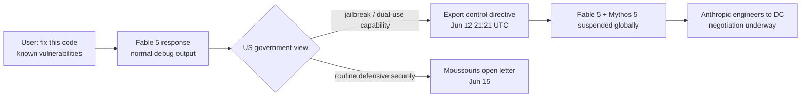

# Ecosystem — 2026-06-16

## Fable 5 export ban escalates: "fix this code," engineers in DC, White House confrontation 

**Source:** [Fortune](https://fortune.com/2026/06/15/fix-this-code-three-words-behind-us-government-shut-down-anthropic-fable-mythos-ai-models-katie-moussouris-open-letter/) · **Type:** update · **Time (UTC):** June 15, ~14:00

Three days after the US Commerce Department forced Anthropic to take Fable 5 and Mythos 5 offline worldwide, two significant new developments emerged on June 15–16. Fortune reported that the "jailbreak" triggering the export-control directive was straightforward: a user gave Fable a code snippet with known vulnerabilities and asked it to fix them. Cybersecurity expert and HackerOne co-founder Kate Moussouris published an open letter calling this "the most valuable thing an AI model can do for defensive security" and arguing the government's logic would block defenders from using AI for routine vulnerability remediation. Separately, Anthropic dispatched senior engineers to Washington to negotiate directly with Commerce Department officials, with joint technical review proposed as a potential path to lifting the suspension.

On June 16, The Atlantic (Matteo Wong) reported that the confrontation has escalated into a broader dispute between Dario Amodei and the Trump administration over AI governance — specifically over Anthropic's refusal to allow military use of its models for any lawful purpose. Meanwhile, David Sacks had previously revealed the administration offered Anthropic a choice before issuing the ban: fix the jailbreak or de-deploy the model, and Amodei declined both.

**Why it matters:** The "fix this code" trigger reveals a deep ambiguity at the heart of AI export controls — the same capability that enables offensive use is foundational to defensive security work. If the standard holds, it potentially restricts all frontier AI coding assistants for any security-adjacent task.

---

## G7 Évian summit: AI CEOs, voluntary commitments, and OpenAI's youth safety institute proposal 

**Source:** [52nd G7 Summit](https://en.wikipedia.org/wiki/52nd_G7_summit) · [Dataconomy](https://dataconomy.com/2026/06/12/ai-leaders-openai-google-deepmind-anthropic-g7-summit/) · **Type:** policy · **Time (UTC):** June 15–17

The 52nd G7 Leaders' Summit in Évian-les-Bains, France (June 15–17) is the first G7 to feature all three major frontier AI lab CEOs — Sam Altman, Demis Hassabis, and Dario Amodei — alongside Mistral AI's Arthur Mensch, Cohere's Aidan Gomez, and others. French President Macron organized a dedicated AI working lunch on June 16. The US has signalled opposition to any binding multilateral AI agreement that could constrain the US industrial advantage, so outcomes are expected to be voluntary commitments. OpenAI's chief global affairs officer said the company expects the summit to produce a package of pledges with youth safety at the top of Altman's agenda.

A second AI governance development was reported June 15: the G7 data protection authorities (DPAs from France, UK, Canada, US, Germany, Italy, and Japan) will convene in Paris June 23–26 — eight days after the leaders' summit — to coordinate enforcement approaches ahead of the EU AI Act's August 2, 2026 deadline for high-risk AI systems. France's CNIL chairs the roundtable; the agenda focuses on cross-border case-sharing and closing the jurisdictional-loophole companies have exploited.

**Why it matters:** Voluntary G7 commitments are lightweight, but the back-to-back structure — leaders' summit June 15–17, DPA enforcement coordination June 23–26 — represents an unusual alignment of political and regulatory timelines six weeks before a hard EU enforcement trigger.

---
