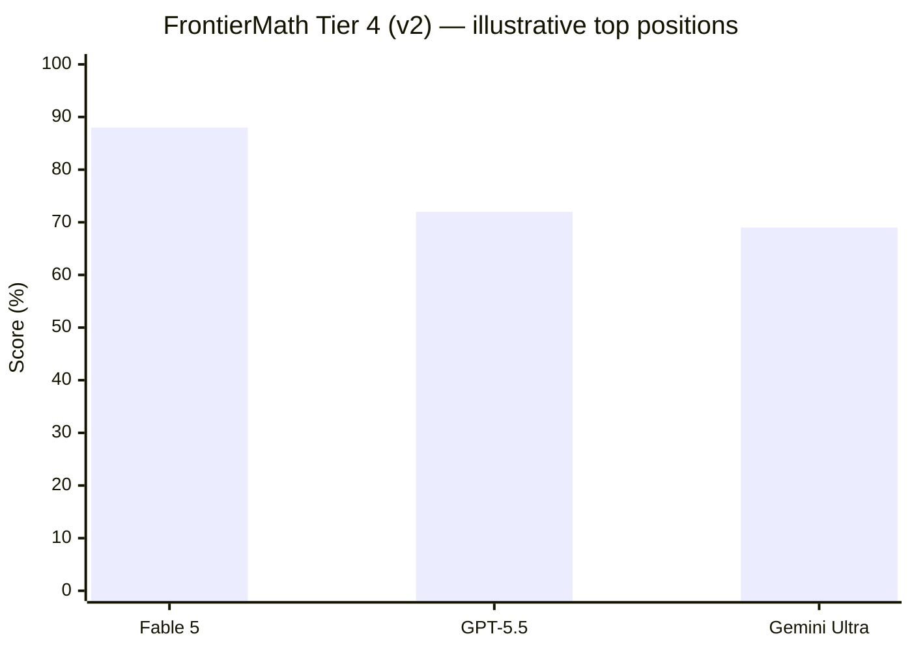

# Research — 2026-06-16

## GitOfThoughts: memory only helps LLM agents past a 0.8 similarity threshold 

**Source:** [arXiv:2606.14470](https://arxiv.org/abs/2606.14470) · **Type:** paper · **Time (UTC):** ~June 14

Researchers propose storing an LLM agent's reasoning tree as a git repository — each thought becomes a commit, confidence scores become git notes, and task outcomes become tags. The architecture makes agent reasoning replayable, diffable, and mergeable across concurrent agents. The paper's most practically significant finding is a negative result: across five memory substrates (none, markdown, vector, graph, git), no format reliably improves accuracy on novel problems. Memory only helps past a "copyability threshold" — retrieved examples must be ≥0.8 similar to the current problem to transfer usefully. Below that threshold, larger models also fail to extract generalizable methods from worked examples. The authors conclude the real lever for accuracy improvement is test-time sampling, not retrieval.

**Why it matters:** Most multi-agent frameworks invest heavily in memory stores; this challenges the assumption that rich memory → better performance on diverse tasks. The auditable git substrate is a practical advance for debugging and human oversight, but teams expecting memory to substitute for sampling budgets should recalibrate.

---

## FrontierMath v2: 42% of problems corrected, Fable 5 now #1 

**Source:** [Epoch AI FrontierMath](https://epoch.ai/frontiermath/tiers-1-4) · **Type:** benchmark update · **Time (UTC):** June 12, ~10:00

Epoch AI released FrontierMath v2 on June 12, correcting errors in 42% of the dataset — including 123 problems across Tiers 1–3 and 12 in Tier 4, plus removing 7 Tier-4 problems entirely. The cleaned benchmark now comprises 338 problems (295 base, 43 Tier-4 expansion). Post-correction model scores shifted upward across the board. Claude Fable 5 now holds the top position at 87% on Tiers 1–3 and 88% on Tier 4; relative rankings are mostly preserved, but the scale of the correction — nearly half the dataset was wrong — materially affects how to interpret any pre-v2 FrontierMath claim.

**Why it matters:** Any benchmark comparison citing FrontierMath scores from before June 12 is comparing against a flawed dataset. Teams evaluating reasoning capabilities on math should rerun evaluations against v2. The 42% error rate also raises questions about expert-curated benchmark quality more broadly.

---

## "Why AI hasn't replaced software engineers, and won't" 

**Source:** [AI Snake Oil / Narayanan & Kappor](https://news.ycombinator.com/item?id=48487540) · **Type:** analysis · **Time (UTC):** June 14

Princeton computer scientists Arvind Narayanan and Sayash Kappor published an essay arguing that software engineering resists AI displacement through a structural "decide-execute-deliver sandwich." AI compresses the middle "execute" layer — code generation and routine implementation — but the outer layers resist automation in ways that further capability improvements cannot overcome. "Deciding what to build" requires organizational context, stakeholder negotiation, and accountability that cannot be extracted from a codebase. "Verifying and being accountable for what is delivered" requires judgment about correctness, security, and fitness-for-purpose that is harder to evaluate than to generate. The essay reached HN's front page.

**Why it matters:** The sandwich framing cuts through the "AI will replace X% of developers by year Y" discourse with a structural argument rather than an empirical one. For engineering teams, the implication is that investment should flow toward the outer layers — specification, verification, ownership — not just generation throughput.

---

## AgentFairBench: Do LLM agents discriminate when they act? 

**Source:** [arXiv:2606.16723](https://arxiv.org/abs/2606.16723) · **Type:** paper · **Time (UTC):** June 16

Morla et al. introduce AgentFairBench, the first systematic benchmark for measuring whether LLM agents make discriminatory decisions in agentic settings — hiring, loan approval, medical triage, and content moderation. Unlike prior fairness benchmarks that test model outputs as text, AgentFairBench evaluates actual agent actions taken through tool calls, which can diverge from the agent's stated reasoning. The paper finds that agents discriminate more in agentic than conversational contexts, and that suppressing bias in the reasoning trace does not reliably suppress it in actions.

**Why it matters:** As LLM agents get deployed in consequential decision pipelines, this benchmark provides a missing audit layer. The finding that action-level bias persists even when reasoning-trace bias is eliminated is significant for safety teams who rely on chain-of-thought monitoring as a proxy for agent behavior.

---
