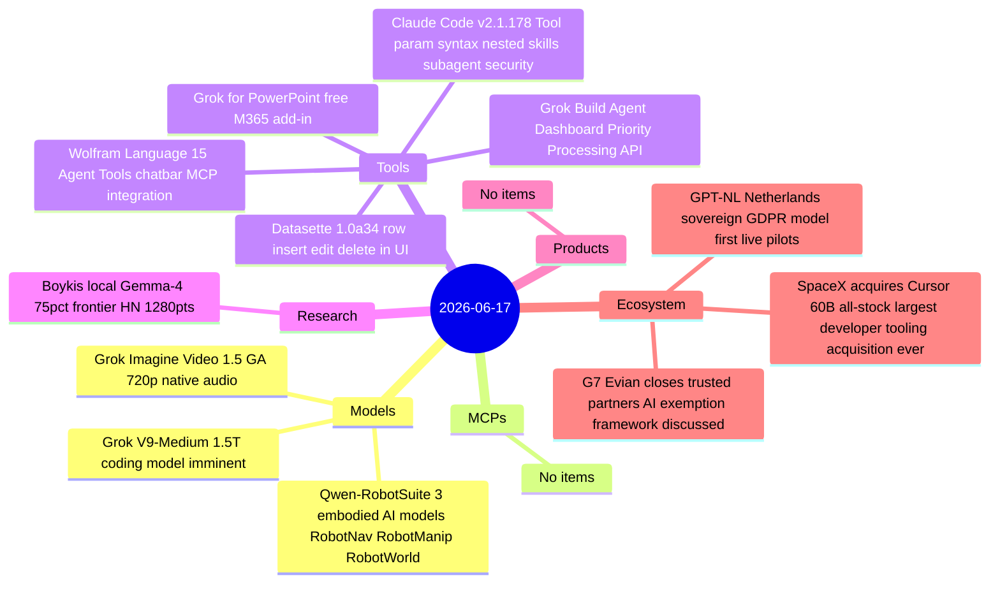
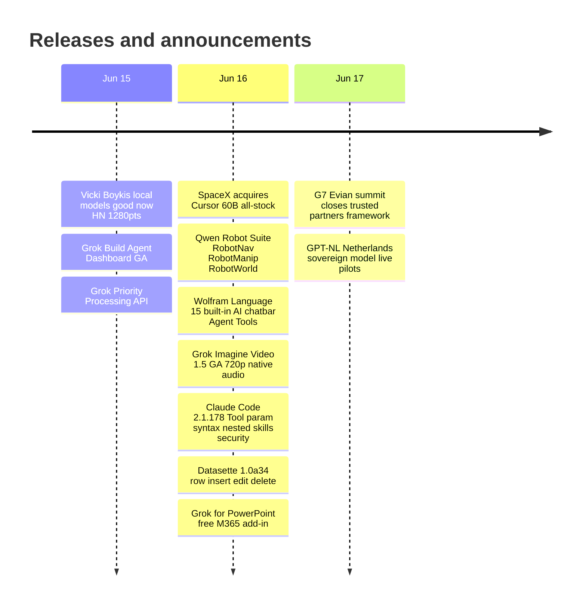

# AI Digest — 2026-06-17

> SpaceX confirmed its $60 billion all-stock acquisition of Cursor (Anysphere) — the largest developer-tooling acquisition in history — just five days after SpaceX's own IPO, vertically integrating xAI from model training through to the IDE used by 4 million developers. The G7 Évian summit closed today with US Commerce Secretary Lutnick proposing a "trusted partners" exemption framework that would restore allied-nation access to Fable 5; Canada's Carney invoked 2008 systemic-risk language and called for mandatory AI infrastructure redundancy. On the models and tools front, Alibaba released three embodied-AI foundation models under the Qwen Robot Suite banner (topping RoboChallenge), Wolfram Language 15 shipped MCP-compatible agent tooling, and a widely-circulated essay argues that local models (Gemma-4) have crossed a practical threshold at ~75% of frontier accuracy.

## Day at a glance

## Top stories

1. **SpaceX acquires Cursor (Anysphere) for $60 billion** — Five days after IPO, SpaceX exercises its April option to buy the 4M-user AI code editor; xAI's Grok V9-Medium was trained on Cursor workflow data, making this a vertical-integration play; closes Q3 2026 pending regulatory approval. [→ details](ecosystem.md#spacex-cursor)
2. **G7 Évian closes: "Trusted Partners" AI framework proposed** — Lutnick pitched vetted allied exemptions from the Fable 5 ban as the summit concluded; Carney invoked 2008 systemic-risk framing and called for mandatory AI diversification across G7 nations. [→ details](ecosystem.md#g7-evian-close)
3. **Alibaba launches Qwen Robot Suite** — Three foundation models covering manipulation (tops RoboChallenge generalist at 59.83 process score / 45% task success), navigation, and world modeling; 38,100 hours of open-source training data. [→ details](models.md#qwen-robotsuite)

## By the numbers

| Category   | Items | Highlight |
|------------|------:|-----------|
| Models     |     3 | Qwen Robot Suite tops RoboChallenge; Grok Imagine 1.5 goes GA |
| MCPs       |     0 | — |
| Tools      |     5 | Wolfram 15 adds MCP-compatible Agent Tools + built-in LLM chatbar |
| Research   |     1 | Boykis: local Gemma-4 at ~75% frontier accuracy, HN #1 with 1,280 pts |
| Products   |     0 | — |
| Ecosystem  |     3 | SpaceX-Cursor $60B; G7 trusted-partners proposal; GPT-NL live pilots |

## Timeline (UTC)

## Files
- [Models](models.md)
- [MCPs](mcps.md)
- [Tools](tools.md)
- [Research](research.md)
- [Products](products.md)
- [Ecosystem](ecosystem.md)
