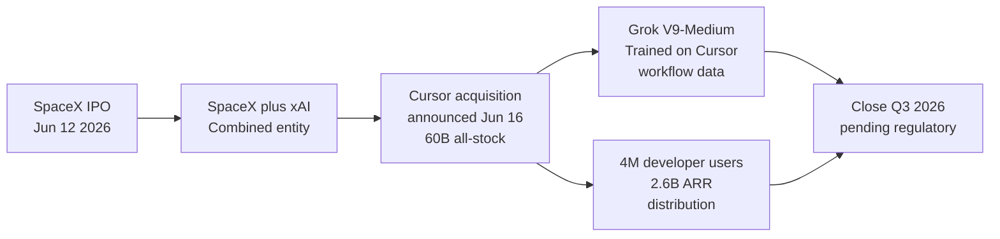

# Ecosystem — 2026-06-17

## SpaceX Acquires Cursor (Anysphere) for $60 Billion 

**Source:** [TechCrunch](https://techcrunch.com/2026/06/16/spacex-to-acquire-cursor-for-60b-in-stock-days-after-blockbuster-ipo/) · **Type:** M&A · **Time (UTC):** Jun 16

SpaceX confirmed an all-stock acquisition of Anysphere (maker of Cursor) for $60 billion on June 16, five days after SpaceX's IPO on June 12. The deal formalizes an option SpaceX secured in April that gave it the right to either pay $10 billion to walk away or $60 billion to acquire the company outright. Cursor has approximately 4 million active developer users and ~$2.6 billion in annualized revenue; it was last independently valued at ~$29 billion. The acquisition is expected to close in Q3 2026 pending regulatory approval.

The strategic rationale ties directly to xAI: SpaceX merged with xAI in early 2026, and Grok V9-Medium — xAI's 1.5T coding model targeting mid-June release — was explicitly trained on Cursor developer workflow data. Owning Cursor gives the combined entity exclusive control of that training data pipeline and a direct distribution channel into the IDE sessions of 4 million developers.

**Why it matters:** At $60B this is the largest acquisition in AI developer-tooling history. It closes off Cursor as a neutral multi-provider surface (Claude, GPT-5.5, Gemini all integrated today) and vertically integrates xAI from model training through to the user-facing IDE. Competing labs lose both a key distribution channel and a benchmark data source; enterprises building on Cursor's API face a new vendor-alignment question.

---

## G7 Évian Closes: "Trusted Partners" AI Exemption Framework Proposed 

**Source:** [US News / Reuters](https://www.usnews.com/news/world/articles/2026-06-16/g7-leaders-discuss-trusted-partners-access-for-cutting-edge-us-ai-models-sources-say) · **Type:** policy · **Time (UTC):** Jun 17

The 52nd G7 summit (Évian-les-Bains, France, June 15–17) closed with AI governance as a central unresolved item. US Commerce Secretary Lutnick pitched a "trusted partners" framework to the other six G7 nations: vetted allied countries and approved companies would receive exemptions from the June 12 export-control directive that blocked all non-US access to Anthropic's Fable 5 and Mythos 5. No formal communiqué text on AI was agreed by end of summit; the proposal was described by sources as a negotiating framework, not a binding commitment. AI executives from Anthropic, OpenAI, Google, and Mistral participated in side sessions.

Canadian PM Mark Carney, drawing on his experience leading both the Bank of Canada and the Bank of England during the 2008 financial crisis, compared the abrupt model suspension to systemic financial counterparty risk. He called for the G7 to mandate AI infrastructure redundancy and diversification — explicitly framing EU tech-sovereignty efforts, India's proposed national AI fund, and UK frontier-model investment as systemic-resilience measures rather than protectionism.

**Why it matters:** If adopted, a "trusted partners" model would create a tiered global AI access regime analogous to export-control partner lists, giving the US government durable leverage over allied nations' AI policy in exchange for model access. Carney's systemic-risk framing is significant because it moves the conversation from "access to a useful tool" to "critical infrastructure dependency" — a framing that historically unlocks central-government capital and mandate for domestic alternatives.

---

## GPT-NL: Netherlands' Sovereign Model Moves to Live Pilots 

**Source:** [Computer Weekly](https://www.computerweekly.com/news/366642524/Netherlands-moves-GPT-NL-from-lab-to-live-first-pilots-under-way) · **Type:** launch · **Time (UTC):** Jun 17

GPT-NL, the open-weight Dutch-language model developed by TNO, SURF, and the Netherlands Forensic Institute with €13.5M in public funding, has moved from pre-training to live feasibility pilots with five organisations; a broader commercial rollout is planned for H2 2026. The model is designed for Dutch language and legal context, built entirely within the Netherlands and EU with full training-data transparency. It holds a Privacy First award as the first LLM "demonstrably compliant with GDPR requirements." The project surfaced on Hacker News today with 204 points, catalysed by the Fable 5 export-control event making sovereign AI alternatives suddenly concrete rather than theoretical.

**Why it matters:** GPT-NL is the only live open-weight model with a verified GDPR compliance record and no US infrastructure dependency. Its emergence on HN's front page the same day the G7 "trusted partners" framework is being discussed illustrates how the Fable 5 export-control event has changed the calculus for every non-Five-Eyes government and enterprise buyer evaluating AI infrastructure lock-in.

---
