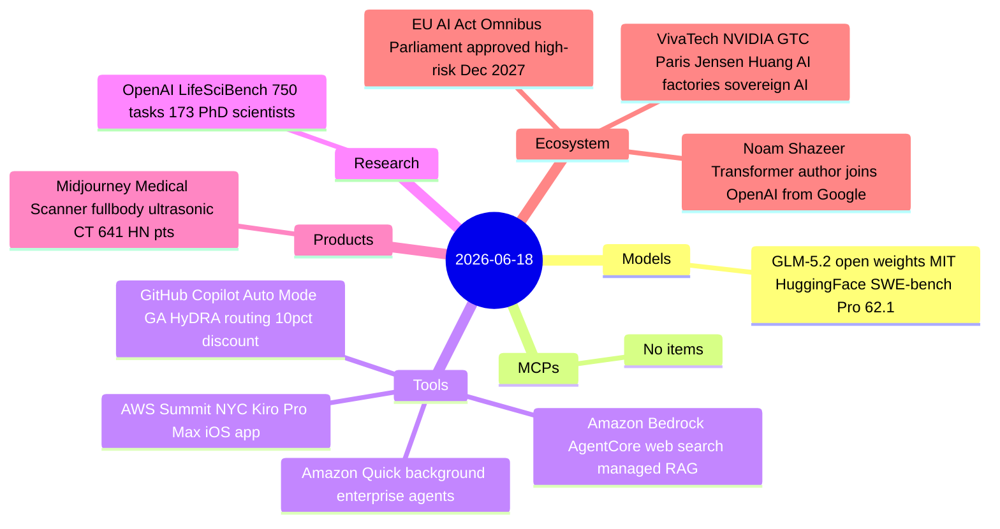
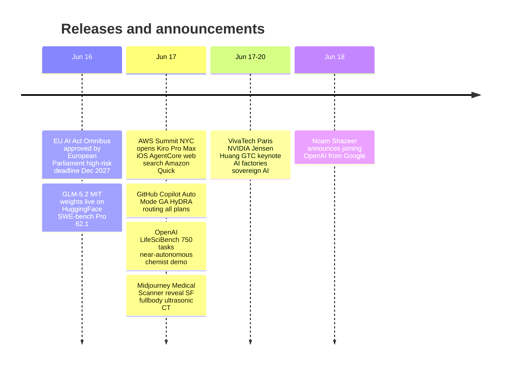

# AI Digest — 2026-06-18

> Noam Shazeer — co-author of the 2017 Transformer paper and co-lead of Google Gemini — announced today he is leaving Google (for the second time) to join OpenAI, a move that ranks among the most consequential individual talent shifts in AI. On the open-source front, Z.ai released GLM-5.2's full MIT-licensed weights on Hugging Face a week ahead of schedule, posting SWE-bench Pro 62.1 to claim the top open-weight coding score and narrowing the gap with Claude Opus 4.8 to 13 points. The day's broader theme was enterprise and tooling maturation: the AWS Summit NYC shipped Kiro Pro Max, Amazon Quick background agents, and Bedrock AgentCore's managed web search; GitHub Copilot Auto Mode went GA for all plans; and the EU Parliament locked in a 16-month extension on high-risk AI Act compliance deadlines, giving enterprises until December 2027.

## Day at a glance

## Top stories

1. **Noam Shazeer joins OpenAI** — The co-author of "Attention Is All You Need" and Google Gemini co-lead leaves Google (where he was brought back for $2.7B from Character.AI in 2024) to join OpenAI, the most significant individual talent move in AI since DeepMind's founding. [→ details](ecosystem.md#shazeer-openai)
2. **GLM-5.2 open weights on Hugging Face (MIT)** — Z.ai's 753B MoE model arrives a week early with benchmark confirmation: SWE-bench Pro 62.1 beats GPT-5.5 at 58.6, ranking #1 open-weight on the Intelligence Index v4.1 at a fraction of frontier API cost. [→ details](models.md#glm-52-open-weights)
3. **Midjourney pivots to medical hardware** — Midjourney Medical revealed a full-body ultrasonic CT scanner with 358,000 transducers and 0.5 mm resolution, targeting a San Francisco spa launch in 2027 as a pre-FDA wedge; the announcement hit 641 pts on HN. [→ details](products.md#midjourney-medical)

## By the numbers

| Category   | Items | Highlight |
|------------|------:|-----------|
| Models     |     1 | GLM-5.2 open weights MIT — #1 open-weight Intelligence Index |
| MCPs       |     0 | — |
| Tools      |     2 | Copilot Auto Mode GA; AWS Summit — Kiro Pro Max, AgentCore, Quick |
| Research   |     1 | OpenAI LifeSciBench — 750 tasks, 7 domains, 173 PhDs |
| Products   |     1 | Midjourney Medical Scanner — full-body ultrasonic CT |
| Ecosystem  |     3 | Shazeer to OpenAI; EU AI Act Omnibus; VivaTech NVIDIA GTC Paris |

## Timeline (UTC)

## Files
- [Models](models.md)
- [MCPs](mcps.md)
- [Tools](tools.md)
- [Research](research.md)
- [Products](products.md)
- [Ecosystem](ecosystem.md)
