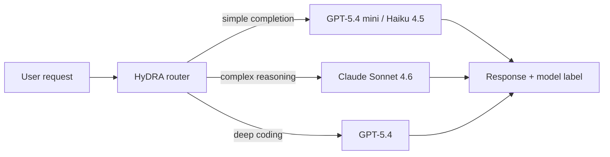

# Tools — 2026-06-18

## GitHub Copilot Auto Mode Goes GA for All Plans 

**Source:** [GitHub Changelog](https://github.blog/changelog/2026-06-17-auto-mode-in-copilot-chat-available-for-all-users/) · [GitHub Blog — model routing](https://github.blog/ai-and-ml/github-copilot/getting-more-from-each-token-how-copilot-improves-context-handling-and-model-routing/) · **Type:** release · **Time (UTC):** Jun 17

Auto mode in Copilot Chat is now generally available on github.com and the GitHub mobile app for all Copilot plan subscribers. The routing engine, called HyDRA, scores each request across reasoning depth, code complexity, debugging difficulty, and tool orchestration needs, then selects from Claude Sonnet 4.6, GPT-5.4, GPT-5.4 mini, and Haiku 4.5 based on plan, live availability, and the computed quality bar. Users can hover over any response to see which model was selected and manually override per response. Paid subscribers using auto mode receive a 10% token discount versus pinning a single model.

**Why it matters:** Auto mode removes the cognitive overhead of manually routing requests to the "right" model in the IDE — the overhead that grows most expensive when a developer switches between quick tab-completions, deep refactors, and natural-language explanations within the same session. The 10% discount makes it economically rational to default to auto in most workflows.

---

## AWS Summit NYC: Kiro Pro Max, iOS App, AgentCore, and Amazon Quick 

**Source:** [AWS Top Announcements blog](https://aws.amazon.com/blogs/aws/top-announcements-of-the-aws-summit-in-new-york-2026/) · [AWS — AI agents](https://www.aboutamazon.com/news/aws/aws-summit-nyc-2026-ai-agents) · [TechTimes — Kiro](https://www.techtimes.com/articles/318546/20260617/aws-summit-new-york-2026-kiro-brings-aerospace-spec-standards-ai-coding.htm) · **Type:** release · **Time (UTC):** Jun 17–18

AWS Summit New York (June 17–18, Javits Center) shipped four AI-developer announcements:

**Kiro Pro Max** adds higher usage limits, access to the latest frontier models, and additional agentic capabilities; it targets teams with sustained high-volume spec-driven coding, building on Kiro's existing spec, hooks, and steering-file architecture.

**Kiro for iOS** (gated preview) lets developers kick off sessions, monitor progress, review code changes, and approve or reject modifications from their phones — the first native mobile surface for Kiro.

**Amazon Bedrock AgentCore** gains a managed Knowledge Base with native data connectors and smart parsing for enterprise RAG pipelines, plus a fully managed web search tool that lets agents ground responses in real-time web knowledge without data leaving AWS. A new S3 Annotations capability lets S3 objects carry up to 1 GB of queryable context, designed for agents that need metadata discovery at scale.

**Amazon Quick** introduces background autonomous agents with specialized expertise in finance, sales, and operations. Agents monitor communication channels proactively and surface recommendations; they run continuously in the background rather than waiting for an explicit user prompt.

**Why it matters:** The Kiro → Pro Max tier and the iOS surface push Amazon's agentic IDE toward parity with multi-device development workflows. Bedrock AgentCore's web search and S3 Annotations address two of the top production pain points for enterprise RAG: knowledge freshness and metadata retrieval at scale. Amazon Quick is AWS's explicit push into the emerging "always-on enterprise agent" product category, competing with Microsoft Copilot's M365 background agents.

---
