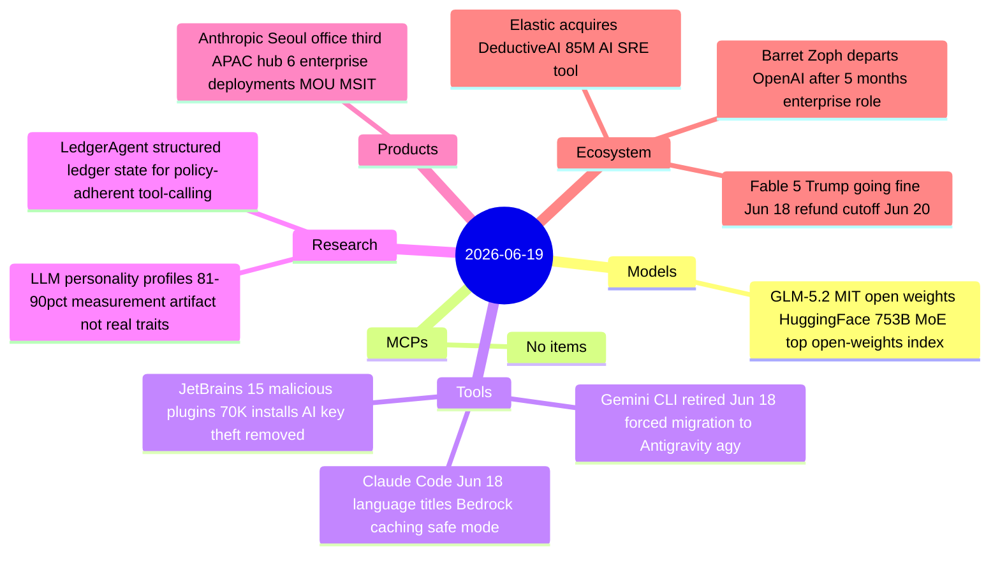

# AI Digest — 2026-06-19

> GLM-5.2's MIT-licensed open weights arrived on HuggingFace on June 16, topping Artificial Analysis's open-weights Intelligence Index and outscoring GPT-5.5 on SWE-bench Pro (62.1 vs 58.6) — a story that slipped past both the June 16 and June 17 digests and makes today's lead. On the tooling front, June 18 was the hard deadline for Google's Gemini CLI retirement: consumer tiers are now cut off and forced onto the Go-based Antigravity CLI (`agy`), which lacks 1:1 feature parity and breaks existing automation. Anthropic deepened its APAC footprint by officially opening its Seoul office with an MOU with Korea's Ministry of Science and ICT and six simultaneous enterprise deployments, timed deliberately against the ongoing Fable 5 export ban — which saw Trump's first public comment ("going fine") from the G7 sidelines on June 18.

## Day at a glance



## Top stories

1. **GLM-5.2 open weights: top-ranked open-source model on Artificial Analysis** — Zhipu AI's 753B MoE under MIT license hits HuggingFace with a score of 51 on the Intelligence Index v4.1 (open weights), 62.1 on SWE-bench Pro (beating GPT-5.5's 58.6), at ~$1.40/$4.40 per 1M tokens via OpenRouter. [→ details](models.md#glm-52-weights)
2. **Gemini CLI consumer tiers retired June 18** — Hard cutover to Antigravity CLI (`agy`); no 1:1 parity at launch; forces migration away from existing shell scripts and CI integrations; enterprise licenses unchanged. [→ details](tools.md#gemini-cli-sunset)
3. **Anthropic opens Seoul office with six enterprise deployments** — NAVER, Samsung SDS, LG CNS, Nexon, Hanwha, and Channel Corp all announced the same day; MOU with Korea MSIT; the APAC expansion is explicitly timed against the Fable 5 export ban. [→ details](products.md#anthropic-seoul)

## By the numbers

| Category   | Items | Highlight |
|------------|------:|-----------|
| Models     |     1 | GLM-5.2 open weights: #1 open-weights model, SWE-bench 62.1 |
| MCPs       |     0 | — |
| Tools      |     3 | Gemini CLI retired; JetBrains plugin supply chain attack (70K installs) |
| Research   |     2 | LLM personality = measurement artifact; LedgerAgent policy-adherent state |
| Products   |     1 | Anthropic Seoul + 6 enterprise deployments + Korea MSIT MOU |
| Ecosystem  |     3 | Elastic-DeductiveAI $85M; Fable 5 "going fine"; Zoph leaves OpenAI |

## Timeline (UTC)

```mermaid
timeline
  title Releases and announcements
  Jun 16 : GLM-5.2 MIT open weights live on HuggingFace and OpenRouter
         : JetBrains Aikido Security report 15 malicious plugins received
  Jun 17 : Simon Willison GLM-5.2 review most powerful text-only open weights
         : Anthropic Seoul office officially opens KiYoung Choi Director
  Jun 18 00:00 : Gemini CLI and Gemini Code Assist consumer tiers hard stop
  Jun 18 : Claude Code update language-aware titles Bedrock caching safe mode
         : Elastic agrees to acquire DeductiveAI for up to 85M
         : Trump at G7 sidelines Fable 5 negotiations going fine
         : JetBrains purges all 15 malicious plugins terminates 7 accounts
  Jun 19 : Barret Zoph departs OpenAI enterprise AI sales role
         : arxiv 2606.20205 LLM personality profiles as measurement artifact
         : arxiv 2606.20529 LedgerAgent structured state for policy-adherent agents
  Jun 20 : Fable 5 refund credit processing cutoff
```

## Files
- [Models](models.md)
- [MCPs](mcps.md)
- [Tools](tools.md)
- [Research](research.md)
- [Products](products.md)
- [Ecosystem](ecosystem.md)
