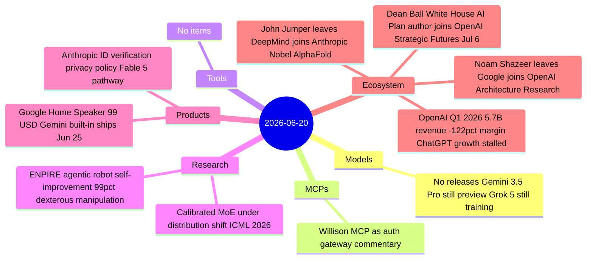
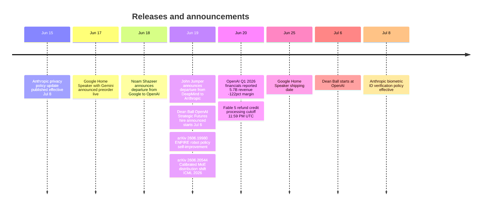

# AI Digest — 2026-06-20

> A quiet news day that will be remembered for one of the most dramatic 48-hour talent reshufflings in AI history: Noam Shazeer (Transformer co-author, Gemini co-lead) left Google for OpenAI on June 18, and John Jumper (Nobel Prize, AlphaFold co-creator) left DeepMind for Anthropic on June 19 — stripping Google of two of its most historically significant researchers in consecutive days. OpenAI also disclosed bruising Q1 2026 financials: $5.7 billion in revenue against a -122% non-GAAP operating margin, with ChatGPT weekly active users stalled well below 1 billion. On the product side, Google announced a $99 Gemini-first smart speaker shipping June 25 — its first new speaker in six years — and Anthropic quietly updated its privacy policy to lay the groundwork for identity-verified Fable 5 access.

## Day at a glance

## Top stories

1. **Consecutive departures gut Google AI leadership** — Noam Shazeer (Gemini co-lead, Transformer co-author) announced June 18 he's joining OpenAI as Lead for Architecture Research; John Jumper (Nobel Prize, AlphaFold) announced June 19 he's joining Anthropic — two foundational figures gone in 48 hours. [→ details](ecosystem.md#shazeer-openai) · [→ Jumper](ecosystem.md#jumper-anthropic)
2. **OpenAI Q1 2026: revenue triples but losses accelerate at -122% margin** — $5.7B revenue and $3.7B cash burn in a single quarter; ChatGPT WAU averaged 905M vs. the stated 1B target; free-to-paid conversion stuck at ~6%. [→ details](ecosystem.md#openai-q1-2026)
3. **Google Home Speaker with Gemini ships June 25** — First new Google smart speaker since 2020, $99, built around Gemini for Home with multi-step commands, Continued Conversation, and 360° audio. [→ details](products.md#google-home-speaker-gemini)

## By the numbers

| Category   | Items | Highlight |
|------------|------:|-----------|
| Models     |     0 | Gemini 3.5 Pro and Grok 5 still pending |
| MCPs       |     1 | Willison: MCP as auth gateway architecture framing |
| Tools      |     0 | — |
| Research   |     2 | ENPIRE: agentic robot self-improvement hits 99% dexterous task success |
| Products   |     2 | Google Home Speaker $99 with Gemini; Anthropic biometric ID verification |
| Ecosystem  |     4 | Shazeer + Jumper dual exodus from Google; OpenAI Q1 losses; Dean Ball hire |

## Timeline (UTC)

## Files
- [Models](models.md)
- [MCPs](mcps.md)
- [Tools](tools.md)
- [Research](research.md)
- [Products](products.md)
- [Ecosystem](ecosystem.md)
