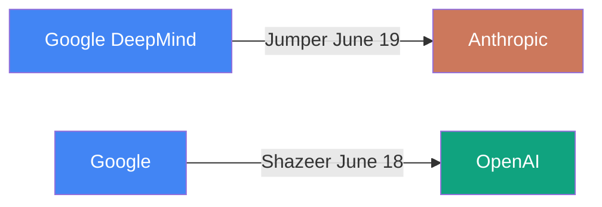

# Ecosystem — 2026-06-20

## Noam Shazeer joins OpenAI as Lead for Architecture Research 

**Source:** [CNBC](https://www.cnbc.com/2026/06/18/google-gemini-co-lead-noam-shazeer-leaves-for-openai.html) · [The Next Web](https://thenextweb.com/news/googles-gemini-co-lead-noam-shazeer-is-leaving-for-openai) · **Type:** personnel · **Time (UTC):** Jun 18

Noam Shazeer — co-author of the 2017 "Attention Is All You Need" paper and most recently co-lead of Google's Gemini model family — has left Google for OpenAI, where he will lead a new Architecture Research function. Shazeer had returned to Google only about two years ago via the ~$2.7 billion acquisition of his startup Character.AI; he departed again roughly two years into that arrangement. Sam Altman publicly called Shazeer "one of the people I have most wanted to work with since OpenAI's early days." OpenAI framed the hire as being aimed at next-generation model architectures beyond the current transformer family.

**Why it matters:** Shazeer is arguably the single most important living figure in transformer architecture, and bringing him to OpenAI ahead of its IPO concentrates foundational research expertise at one lab while dealing a second consecutive high-profile departure blow to Google's Gemini effort (following Barret Zoph's exit from OpenAI's enterprise team just days earlier — itself a rebalancing, not a defection).

---

## John Jumper leaves DeepMind for Anthropic 

**Source:** [Bloomberg](https://www.bloomberg.com/news/articles/2026-06-19/nobel-winner-john-jumper-to-leave-google-deepmind-for-anthropic) · [CNBC](https://www.cnbc.com/2026/06/19/john-jumper-to-leave-google-deepmind-for-anthropic.html) · [John Jumper on X](https://x.com/JohnJumperSci/status/2068001285173834106) · **Type:** personnel · **Time (UTC):** Jun 19

John Jumper — 2024 Nobel Prize laureate in chemistry (alongside Demis Hassabis) for AlphaFold, and VP-level research leader at Google DeepMind for nearly nine years — announced he is leaving to join Anthropic after taking time to recharge. Jumper's X post expressed gratitude to Hassabis and credited the DeepMind team with shaping how he approaches science; he did not name a specific role or team at Anthropic. The move follows just one day after Noam Shazeer's departure from Google to OpenAI.

**Why it matters:** Two consecutive days stripped Google of the co-lead of its frontier model programme (Shazeer) and the scientist behind arguably its most impactful research output (AlphaFold). For Anthropic, acquiring a Nobel Prize–level computational biologist immediately after the Fable 5 export-control crisis signals a long-term bet on biological and scientific capabilities rather than just coding.

---

## OpenAI hires Dean Ball as head of Strategic Futures 

**Source:** [Yahoo News](https://www.yahoo.com/news/politics/articles/openai-hires-former-trump-ai-153559746.html) · [The AI Insider](https://theaiinsider.tech/2026/06/19/openai-hires-transformer-co-author-noam-shazeer-and-former-white-house-ai-official-dean-ball-ahead-of-ipo/) · **Type:** personnel · **Time (UTC):** Jun 19

Dean Ball, the former Trump White House OSTP official who authored the US AI Action Plan, will join OpenAI on July 6 to lead a newly created Strategic Futures team, reporting to Chief Strategy Officer Jason Kwon. Ball's remit will cover catastrophic risk, recursive self-improvement, labor market impacts, and the relationship between frontier labs and governments — combining internal governance with external policy positioning.

**Why it matters:** Embedding the architect of the Trump administration's AI deregulation framework inside OpenAI gives the company a direct channel to White House thinking as the Fable 5 export control saga reshapes what frontier AI policy looks like for all US labs.

---

## OpenAI Q1 2026: $5.7B revenue, -122% non-GAAP margin, ChatGPT growth stalled 

**Source:** [Where's Your Ed At](https://www.wheresyoured.at/news-openai-had-a-negative-122-operating-margin-in-q1-2026-and-chatgpt-growth-has-stalled/) · [The Decoder](https://llm-stats.com/ai-news) · [PYMNTS](https://www.pymnts.com/news/artificial-intelligence/2026/openai-ran-through-4-billion-dollars-q1/) · **Type:** funding/financials · **Time (UTC):** Jun 20

OpenAI's Q1 2026 financials (reported to investors) show $5.7 billion in revenue — triple year-on-year — alongside approximately $3.7 billion in cash burn, with stock-based compensation alone consuming $2.3 billion. The non-GAAP operating margin stands at -122%, implying roughly $6.95 billion in quarterly losses. On a run-rate basis, OpenAI is tracking toward $30 billion in annual revenue but more than $36 billion in losses. ChatGPT weekly active users averaged 905 million across the quarter, peaking at 920 million in February — well below the previously stated goal of 1 billion users by 2025, with a free-to-paid conversion rate of roughly 6% across ~55 million subscribers.

**Why it matters:** The data points to a structural unit-economics problem: revenue scales with model usage, but so do compute and compensation costs — and the latter have grown faster. With $73 billion in cash (largely from recent fundraising rather than operating cash flow) and a pre-IPO trajectory, the pressure to convert free users and demonstrate a path to profitability before going public is mounting.

| Metric | Q1 2026 |
|--------|---------|
| Revenue | $5.7B |
| Cash burn | ~$3.7B |
| Non-GAAP operating margin | -122% |
| Weekly active users (avg) | 905M |
| Paying subscribers | ~55M |
| Free-to-paid conversion | ~6% |
| Cash on hand | >$73B |

---
