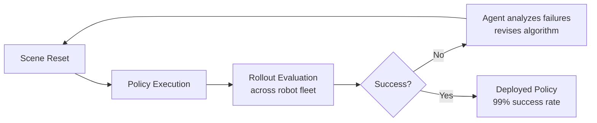

# Research — 2026-06-20

## ENPIRE: Agentic Robot Policy Self-Improvement in the Real World 

**Source:** [arXiv 2606.19980](https://arxiv.org/abs/2606.19980) · **Type:** paper · **Time (UTC):** Jun 19

Authors from CMU, Berkeley, Stanford, NVIDIA, and UT Austin present ENPIRE, a framework in which frontier coding agents autonomously train and improve robot manipulation policies in physical environments — with no human in the loop beyond the initial setup. The system runs a four-module loop: environment management (scene resets), policy execution, rollout evaluation across multiple robots, and an evolution step where the agent analyzes failures and revises the training algorithm. On dexterous manipulation tasks (organizing a pin box, fastening a zip tie, tool use), ENPIRE achieves a 99% success rate. The framework scales across robot fleets and is designed to support controlled ablations.

**Why it matters:** Moving from human-supervised policy training to agent-driven self-improvement in the physical world — not just simulation — is a meaningful threshold. The 99% success rate on tasks that previously required extensive human curriculum design is a practical signal that agentic methods are compressing robotics iteration cycles.

---

## Calibrated Mixture-of-Experts Under Distribution Shift (ICML 2026) 

**Source:** [arXiv 2606.20544](https://arxiv.org/abs/2606.20544) · **Type:** paper · **Time (UTC):** Jun 19

Wong et al. (Johns Hopkins, UC Davis) establish when MoE models remain calibrated as data distributions shift — a gap in the theory that matters significantly as MoE architectures dominate frontier deployments. The core finding: for **hard-routed** MoE models, expert-level calibration is sufficient to guarantee overall model calibration under shift; for **soft-routed** models, it is not. The paper proposes an adversarial reweighting method that penalizes calibration errors of the routed aggregate under distribution shift, improving average performance and performance on difficult data subsets. Published at ICML 2026.

**Why it matters:** Most production MoE deployments (Mixtral-style, Grok V9-Medium, GLM-5.2) use hard routing, so this result gives practitioners a theoretically grounded reason to trust expert-level calibration procedures — and warns that soft-routing designs need additional care before deployment in high-stakes settings.

---
