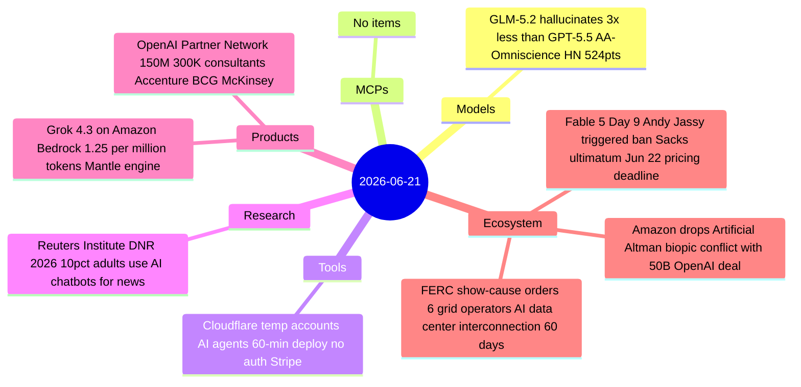
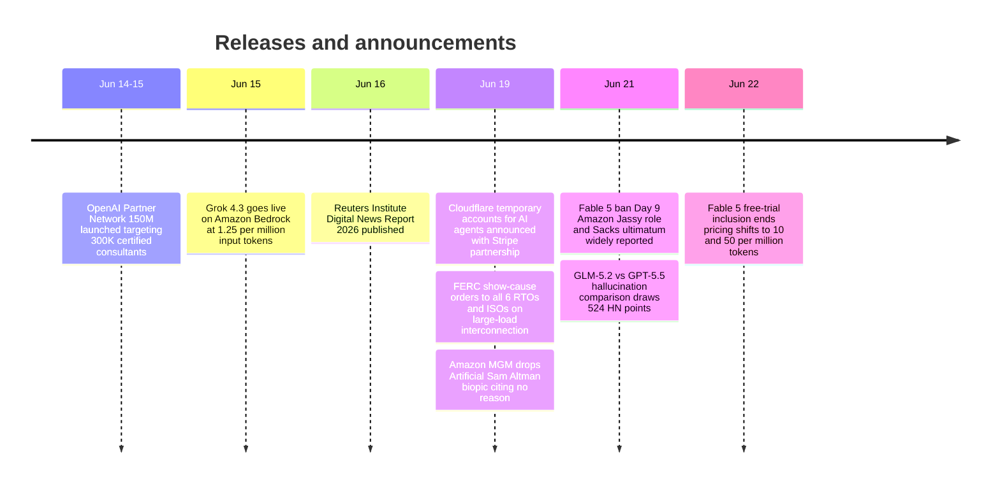

# AI Digest — 2026-06-21

> A quiet Sunday with no major model launches. The dominant story remains the Fable 5 export control ban (Day 9), with newly disclosed details: Amazon CEO Andy Jassy placed the late-night call to the White House that triggered the June 12 directive, and David Sacks publicly framed the restoration path as "Anthropic fixes the jailbreak, the export control is lifted" — a condition security experts call technically impossible. The Fable 5 free-trial inclusion on paid plans closes tomorrow (June 22), converting access to $10/$50 per million tokens usage credits while the model remains offline. Infrastructure story of the day: FERC issued show-cause orders to all six US grid operators to rewrite AI data center interconnection rules within 60 days, marking the clearest federal signal yet that grid capacity — not chips — is the binding AI infrastructure constraint.

## Day at a glance

## Top stories

1. **Fable 5: Amazon's triggering role and Sacks ultimatum disclosed, June 22 pricing cutoff tomorrow** — Andy Jassy called the White House to flag the Fable 5 jailbreak before the ban; David Sacks publicly set the resolution condition: fix the jailbreak. The free-trial window closes tomorrow, shifting to $10/$50 per million tokens regardless of suspension status. [→ details](ecosystem.md#fable5-amazon-sacks)
2. **FERC issues show-cause orders to all six US grid operators on AI data center power** — June 19 orders give RTOs/ISOs 60 days to justify or rewrite large-load interconnection tariffs; five mandatory areas including co-location rules and flexible load services. [→ details](ecosystem.md#ferc-grid-orders)
3. **Cloudflare ships temporary accounts for AI agents** — `wrangler deploy --temporary` lets an agent spin up Workers, KV, D1, Durable Objects with no OAuth flow or MFA; 60-minute preview with claim-to-keep; Stripe partnership extends this to domain registration and billing. [→ details](tools.md#cloudflare-temp-accounts)

## By the numbers

| Category   | Items | Highlight |
|------------|------:|-----------|
| Models     |     1 | GLM-5.2: 3× lower hallucination rate vs GPT-5.5 (AA-Omniscience) |
| MCPs       |     0 | — |
| Tools      |     1 | Cloudflare temp accounts: no-auth agent deployments + Stripe provisioning |
| Research   |     1 | Reuters Institute: 10% of global adults use AI chatbots for news weekly |
| Products   |     2 | Grok 4.3 on Bedrock $1.25/M; OpenAI Partner Network $150M |
| Ecosystem  |     3 | Fable 5 ban details; Amazon drops Altman biopic; FERC grid orders |

## Timeline (UTC)

## Files
- [Models](models.md)
- [MCPs](mcps.md)
- [Tools](tools.md)
- [Research](research.md)
- [Products](products.md)
- [Ecosystem](ecosystem.md)
