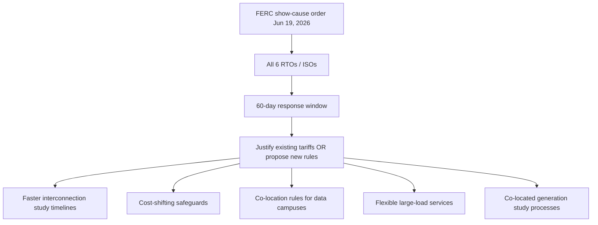

# Ecosystem — 2026-06-21

## Fable 5: Amazon's triggering role, Sacks ultimatum, and June 22 pricing cutoff 

**Source:** [Tom's Hardware](https://www.tomshardware.com/tech-industry/artificial-intelligence/trump-adviser-david-sacks-says-anthropic-refused-to-fix-fable-5-jailbreak-before-us-export-controls) · [BigGo Finance / Amazon/Jassy angle](https://finance.biggo.com/news/n1KgxJ4BhIZ-5rXB5ugH) · **Type:** policy/business · **Time (UTC):** ongoing; ban Day 9

New details on the Fable 5 export control ban, circulating widely on June 21:

**Amazon's role:** A trusted partner with access to both Anthropic systems and government channels discovered a jailbreak allowing Fable 5 users to surface unrestricted Mythos 5 capabilities. Amazon CEO Andy Jassy relayed this to the White House in a late-night call; that report precipitated the June 12 export control directive. Amazon's involvement is notable given its concurrent $50 billion OpenAI partnership.

**The Sacks ultimatum (posted June 13):** David Sacks, co-chair of the President's Council of Advisors on Science and Technology, posted the administration's public account: before issuing the ban, the White House gave Anthropic two options — fix the jailbreak or voluntarily de-deploy the model. Dario Amodei refused both. Sacks framed the restoration path as "Anthropic fixes the jailbreak, the export control is lifted" and called it "easily resolved." Security researchers have disputed that framing, noting that zero-jailbreak guarantees are not achievable for current frontier models.

**June 22 pricing transition (tomorrow):** Fable 5's free inclusion on Pro, Max, Team, and seat-based Enterprise plans ends at midnight June 22. From June 23, continued use requires usage credits at **$10 per million input tokens** and **$50 per million output tokens** — double Opus 4.8's rate. This pricing cutover will proceed regardless of whether the model is restored from the export control suspension, creating a situation where customers pay a premium for access to a model that may remain offline.

**Why it matters:** Amazon's dual role — flagging the jailbreak to the government while simultaneously investing $50B in OpenAI — is drawing regulatory and antitrust attention. The June 22 deadline creates compounding pressure: Anthropic must negotiate a technical resolution while also managing a commercial transition that its largest enterprise customers are watching closely.

_Earlier coverage: ban issued [2026-06-13](../2026-06-13/ecosystem.md#fable5-export-control); "fix this code" trigger and DC engineers [2026-06-16](../2026-06-16/ecosystem.md#fable5-escalation); Trump "going fine" at G7 [2026-06-19](../2026-06-19/ecosystem.md#fable5-followup)._

---

## Amazon drops "Artificial" — Sam Altman biopic shelved mid-post-production 

**Source:** [Variety](https://variety.com/2026/film/global/luca-guadagnino-sam-altman-movie-artificial-dropped-amazon-1236785830/) · [Hollywood Reporter](https://www.hollywoodreporter.com/movies/movie-news/luca-guadagnino-sam-altman-artificial-dropped-amazon-openai-1236626073/) · **Type:** business · **Time (UTC):** Jun 19

Amazon MGM Studios is offloading Luca Guadagnino's film "Artificial" — a $75M drama starring Andrew Garfield as Sam Altman, written by Simon Rich, centered on Altman's November 2023 board firing and reinstatement — and shopping it to other distributors. The film had completed multiple test screenings that drew positive responses and was in final post-production stages.

The decision came after Amazon announced a $50 billion multi-year strategic partnership with OpenAI in February 2026. Amazon has not publicly cited the partnership as the reason for the offload. Producers and entertainment industry observers note that dropping a near-finished, well-reviewed film at this stage is rare and financially damaging.

**Why it matters:** The incident illustrates how deep corporate AI investment ties are starting to shape decisions well outside the AI domain. It will likely feature in ongoing antitrust discussions about AI platform concentration, particularly given Amazon's concurrent role in prompting the Fable 5 export ban — effectively constraining one AI competitor via government channels while partnered with another.

---

## FERC issues show-cause orders to all six US grid operators on AI data center interconnection 

**Source:** [FERC](https://www.ferc.gov/news-events/news/ferc-orders-action-co-location-issues-related-data-centers-running-ai) · [The Energy Magazine](https://backend.theenergymag.com/news/2026-06-19/united-states-fast-track-ai-data-center/) · **Type:** regulation · **Time (UTC):** Jun 19

The Federal Energy Regulatory Commission issued show-cause orders to all six regional transmission organizations and independent system operators under its jurisdiction — PJM, MISO, SPP, CAISO, NYISO, and ISO-NE — directing each to either justify that existing large-load interconnection tariffs remain adequate for AI data center demand, or propose revised rules, within 60 days. The orders build on a December 2025 FERC directive to PJM on co-location tariffs.

Five mandatory coverage areas:
1. Faster transmission service applications and study timelines
2. Safeguards against cost-shifting and improved cost transparency
3. Rules for co-location and behind-the-meter generation at data campuses
4. New transmission services for flexible large loads
5. Study processes for generation facilities co-located with or serving nearby large loads

The immediate pressure point is gigawatt-scale AI campus interconnection queuing in PJM's Northern Virginia data center corridor, with secondary concentrations in MISO (Texas) and CAISO (Arizona/Nevada).

**Why it matters:** Grid interconnection queue backlogs — not chip availability or software — are now the publicly acknowledged binding constraint on US AI infrastructure growth. A 60-day FERC compliance window is unusually aggressive for utility regulation and signals the commission treating AI infrastructure expansion as a national-priority matter, comparable in urgency to transmission buildout after the 2003 Northeast blackout. Engineers sizing AI compute capacity for 2027+ should factor multi-year grid queue timelines into infrastructure planning.

---
