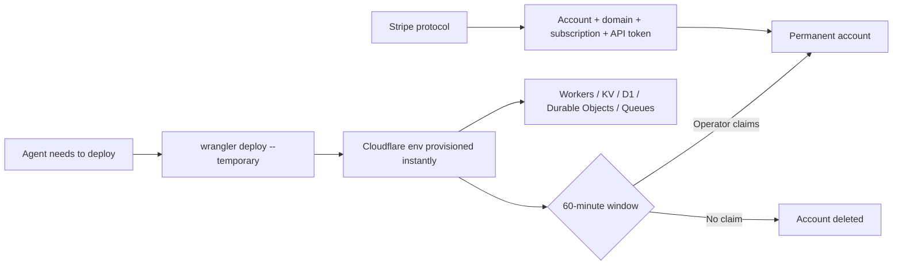

# Tools — 2026-06-21

## Cloudflare Temporary Accounts for AI Agents 

**Source:** [Cloudflare Blog](https://blog.cloudflare.com/temporary-accounts/) · **Type:** release · **Time (UTC):** Jun 19

Cloudflare launched temporary preview accounts specifically for autonomous agents. Running `wrangler deploy --temporary` provisions a Cloudflare environment — Workers, Workers KV, D1, Durable Objects, Queues, static assets, SSL certificates — without requiring any pre-existing account, OAuth flow, dashboard navigation, or MFA prompt. The deployment stays live for 60 minutes; the agent's operator can claim the account within that window to make it permanent.

A co-designed Stripe protocol extends the model further: an agent can provision a Cloudflare account on a user's behalf, register a domain, start a subscription, and retrieve a deploy-ready API token — zero copy-paste or manual credit card entry required.

**Why it matters:** Human-centric authentication flows have been one of the last hard stops in fully autonomous agent pipelines that need to provision infrastructure as part of a task. This removes that barrier for the most common Cloudflare use case (deploy-and-test iteration), and the Stripe integration shows a credible path toward agentic provisioning that doesn't require any human-in-the-loop credential handling at all.

---
