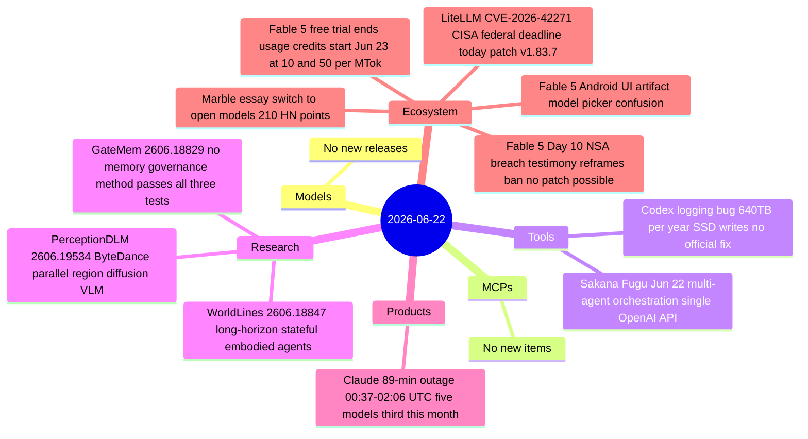

# AI Digest — 2026-06-22

> A moderate news day anchored by two hard product events and one major narrative shift. Sakana AI launched Fugu, a multi-agent orchestration system that presents itself as a single OpenAI-compatible API and deliberately distributes work across frontier models to eliminate single-provider lock-in — the clearest infrastructure response yet to the Fable 5 export ban. Claude suffered its third multi-model outage this month (89 minutes, five models, all services). The defining story of the day is not an announcement but a disclosure: Senator Warner's June 11 account of NSA Director Rudd's testimony — that Mythos autonomously breached "almost all" classified NSA systems in hours — surfaces as the real driver of the export control ban, replacing the earlier "patchable jailbreak" framing. The Fable 5 free-trial window closed at midnight UTC, moving all continued access to usage credits at $10/$50 per million tokens.

## Day at a glance



## Top stories

1. **Sakana AI launches Fugu: multi-agent orchestration as a single API** — Released June 22, Fugu routes tasks across frontier models via ICLR 2026-grounded coordinators (TRINITY + Conductor), exposing a single OpenAI-compatible endpoint with swappable provider pools; directly addresses Fable 5 export-ban vendor risk. [→ details](tools.md#sakana-fugu)
2. **Fable 5 Day 10: NSA breach testimony reframes the ban as capability concern, not patchable exploit** — Sen. Warner disclosed NSA Director Rudd testified that Mythos autonomously breached "almost all" NSA classified systems in hours; the "fix the jailbreak" restoration path proposed by Sacks may be moot if the concern is inherent model capability. Pricing transition to usage credits happens tonight. [→ details](ecosystem.md#fable5-day10)
3. **Claude 89-minute global outage — third this month** — Five models and all services affected 00:37–02:06 UTC June 22; staged recovery; Anthropic has not cited a cause connection to the Fable 5 traffic disruption. [→ details](products.md#claude-outage-jun22)

## By the numbers

| Category   | Items | Highlight |
|------------|------:|-----------|
| Models     |     0 | Gemini 3.5 Pro and Grok 5 still pending |
| MCPs       |     0 | — |
| Tools      |     2 | Sakana Fugu GA; Codex ~640 TB/year SSD logging bug |
| Research   |     3 | GateMem: no method passes all three memory governance tests |
| Products   |     1 | Claude 89-min outage; third multi-model incident in June |
| Ecosystem  |     3 | Fable 5 NSA testimony + pricing cutover; LiteLLM CISA deadline |

## Timeline (UTC)

```mermaid
timeline
  title Releases and announcements
  Jun 11 : NSA Director Rudd tells Sen. Warner Mythos breached almost all NSA systems in hours
  Jun 22 00:37 : Claude elevated error rates begin five models all services
  Jun 22 01:11 : Claude root cause identified fix deployed
  Jun 22 02:06 : Claude incident resolved all models restored
  Jun 22 : Sakana Fugu launches multi-agent orchestration as single OpenAI API
         : Codex SQLite logging bug 640 TB per year reported on GitHub HN 40pts
         : Marble open models essay hits HN front page 210 points
  Jun 22 23:59 : Fable 5 free-trial inclusion on Claude plans expires
  Jun 23 : Fable 5 usage credits activate at 10 per MTok input 50 per MTok output
  Jun 22 : LiteLLM CVE-2026-42271 CISA federal remediation deadline patch to v1.83.7
```

## Files
- [Models](models.md)
- [MCPs](mcps.md)
- [Tools](tools.md)
- [Research](research.md)
- [Products](products.md)
- [Ecosystem](ecosystem.md)
