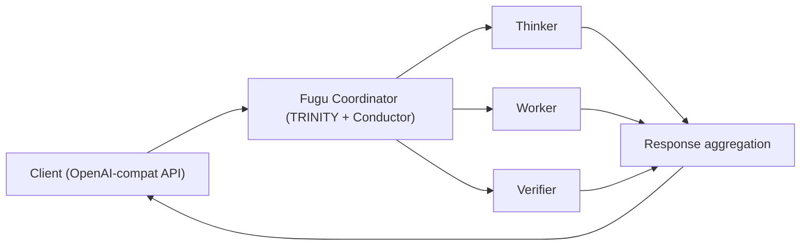

# Tools — 2026-06-22

## Sakana AI launches Fugu: multi-agent orchestration as a single model API 

**Source:** [Sakana AI](https://sakana.ai/fugu/) · [GitHub](https://github.com/SakanaAI/fugu) · **Type:** launch · **Time (UTC):** Jun 22

Sakana AI released Fugu, a system that presents itself as a single OpenAI-compatible model endpoint but internally routes tasks across a pool of frontier models — including GPT-5.5, Gemini 3.1 Pro, and Opus 4.8 — using a learned coordinator. The routing logic is not hand-coded: it is derived from two ICLR 2026 papers: TRINITY (an evolved multi-turn LLM coordinator) and Conductor (reinforcement-learning-based natural-language orchestration). Fugu assigns Thinker, Worker, and Verifier roles dynamically per task. Two tiers ship at launch: Fugu (balanced performance and latency) and Fugu Ultra (maximum accuracy, up to $10 per message). EU users are excluded at launch; a free second month runs through July 2026.

**Why it matters:** Fugu is a direct architectural response to the Fable 5 export ban: CEO David Ha framed single-provider API dependence as "a material vulnerability." Engineers can point a single `base_url` at Fugu Ultra and get a system that reports GPQA-Diamond and SWE-Pro scores matching frontier flagship models — while retaining the ability to swap underlying providers without any code change. The ICLR 2026 grounding distinguishes it from earlier rule-based routers.

---

## OpenAI Codex logging bug writes ~640 TB/year to local SSD 

**Source:** [GitHub Issue #28224](https://github.com/openai/codex/issues/28224) · **Type:** bug · **Time (UTC):** Jun 22

A GitHub issue opened June 22 (40 HN points) documents that Codex continuously writes to a local SQLite feedback log (`~/.codex/logs_2.sqlite`) at a rate that extrapolates to roughly 640 TB/year. A contributor reported 37 TB written to their main SSD after 21 days of normal Codex use. The root cause is a global TRACE default in the SQLite logging sink that bypasses `RUST_LOG` filtering: TRACE-level entries — including raw protocol payloads and dependency noise — are persisted even when the environment variable is set to `warn`. The insert-and-prune cycle amplifies write volume further. No official fix has shipped; the issue recommends redirecting `logs_2.sqlite` to a tmpfs mount as a temporary workaround. Eliminating TRACE persistence for the SQLite sink would reduce retained log bytes by an estimated 96%.

**Why it matters:** Consumer SSDs with 300–600 TB total write endurance could be damaged within months of sustained Codex use. Any team running Codex on developer laptops or in persistent CI environments should check SSD write counters and apply the tmpfs workaround until a patch ships.

---
