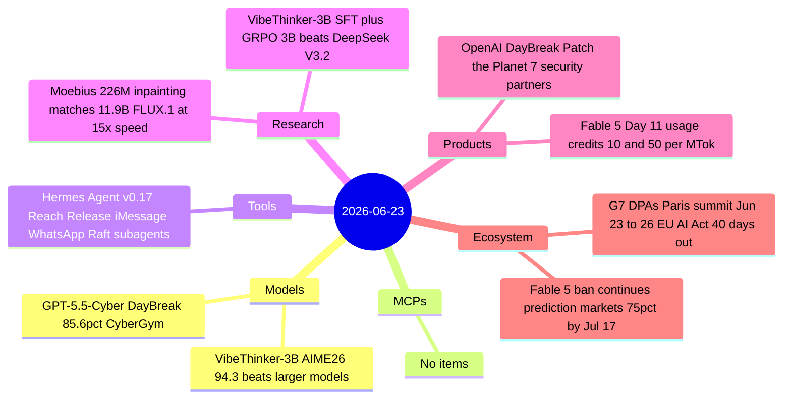

# AI Digest — 2026-06-23

> OpenAI's DayBreak initiative expanded on June 22 with an improved GPT-5.5-Cyber model, a new "Patch the Planet" open-source security patching program, and seven enterprise security vendor partners — the most coordinated AI-in-security launch of the year. On the research side, the Moebius team showed a 226M-parameter inpainting model matching 11.9B-parameter FLUX.1-Fill-Dev at 15× the inference speed, a sign that task-specific distillation is closing the efficiency gap faster than expected. The G7 data protection authorities summit opened in Paris today with a 40-day countdown to the EU AI Act's high-risk system enforcement deadline, making cross-border AI enforcement coordination the day's defining policy story; Fable 5 usage credits simultaneously activated at $10/$50 per million tokens on Day 11 of the export ban, with no restoration date set.

## Day at a glance



## Top stories

1. **OpenAI expands DayBreak with GPT-5.5-Cyber and Patch the Planet** — The updated GPT-5.5-Cyber scores 85.6% on CyberGym (up from 81.8%), 39.5% on ExploitGym, and 69.8% on SEC-bench Pro; OpenAI simultaneously launched a co-funded open-source patching initiative with Trail of Bits and HackerOne and a partner program reaching Accenture, Cisco, CrowdStrike, IBM, Okta, Palo Alto Networks, and Wiz. [→ details](models.md#gpt-55-cyber) · [→ program](products.md#daybreak-expansion)
2. **Moebius: 226M inpainting model matches 12B-scale counterparts** — The HUST team published arXiv 2606.19195 and released code for Moebius, a 226M-parameter image inpainting model that matches or exceeds FLUX.1-Fill-Dev (11.9B) across six benchmarks at 15× faster inference (26ms/step); Simon Willison's same-day browser port via WebGPU reached HN with 285 points. [→ details](research.md#moebius)
3. **G7 DPAs convene in Paris — EU AI Act enforcement 40 days out** — Seven national data-protection authorities opened a four-day enforcement-coordination summit today; cross-border case-sharing and aligned enforcement against AI systems are the stated goals, with EU AI Act high-risk obligations activating August 2. [→ details](ecosystem.md#g7-dpas-paris)

## By the numbers

| Category   | Items | Highlight |
|------------|------:|-----------|
| Models     |     1 | GPT-5.5-Cyber: 85.6% CyberGym, 39.5% ExploitGym, 69.8% SEC-bench Pro |
| MCPs       |     0 | — |
| Tools      |     1 | Hermes Agent v0.17: iMessage, WhatsApp, Raft channels + async subagents |
| Research   |     2 | Moebius 226M beats 11.9B FLUX.1; VibeThinker-3B matches frontier reasoning |
| Products   |     2 | DayBreak Patch the Planet + partner network; Fable 5 credits go live |
| Ecosystem  |     2 | G7 DPAs Paris; Fable 5 Day 11 ongoing with 75% market odds by Jul 17 |

## Timeline (UTC)

```mermaid
timeline
  title Releases and announcements
  Jun 19 : Hermes Agent v0.17 The Reach Release iMessage WhatsApp Raft async subagents
  Jun 22 : OpenAI DayBreak GPT-5.5-Cyber improved model Patch the Planet announced
         : Moebius 226M inpainting paper arXiv 2606.19195 Willison browser demo 285 HN pts
  Jun 23 00:00 : Fable 5 usage credits activate at 10 and 50 per million tokens
  Jun 23 : G7 DPAs Paris 4-day summit begins cross-border AI enforcement coordination
         : VibeThinker-3B AIME26 94.3 paper reaches HN front page 165 pts
  Aug 2  : EU AI Act high-risk system enforcement obligations take effect
```

## Files
- [Models](models.md)
- [MCPs](mcps.md)
- [Tools](tools.md)
- [Research](research.md)
- [Products](products.md)
- [Ecosystem](ecosystem.md)
