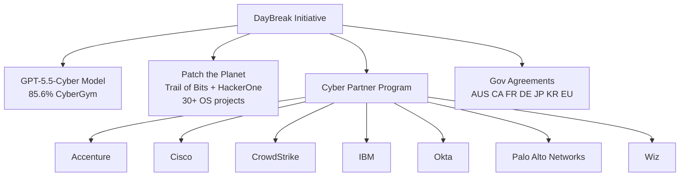

# Products — 2026-06-23

## OpenAI DayBreak Expansion: Patch the Planet + Partner Network 

**Source:** [SiliconANGLE](https://siliconangle.com/2026/06/22/openai-expands-daybreak-patch-planet-full-gpt-5-5-cyber-release/) · **Type:** launch · **Time (UTC):** Jun 22 ~17:00

OpenAI expanded the DayBreak initiative on June 22 with three simultaneous moves alongside the GPT-5.5-Cyber model update (see [Models](models.md#gpt-55-cyber)). First, "Patch the Planet" — a co-funded open-source patching program with Trail of Bits and HackerOne — pays expert security researchers to work directly with open-source project maintainers; over 30 projects have committed including cURL, Python, Go, and Sigstore; a five-day initial sprint "surfaced hundreds of issues and merged dozens of patches." Second, the Daybreak Cyber Partner Program allows security vendors to embed GPT-5.5 with Trusted Access into their own products; launch partners are Accenture, Cisco, CrowdStrike, IBM, Okta, Palo Alto Networks, and Wiz. Third, the Codex Security plugin received an update. OpenAI has also established DayBreak access agreements with Australia, Canada, France, Germany, Japan, South Korea, and EU institutions.

**Why it matters:** The partner program is significant for security engineers who use CrowdStrike, Palo Alto, or Wiz in production — GPT-5.5-Cyber's vulnerability detection capabilities will appear as native features inside those platforms rather than a separate API integration. The Patch the Planet initiative is the first major AI-funded open-source security program with named maintainer commitments from foundational projects.

---

## Fable 5 Usage Credits Activate — Day 11 of Export Ban 

**Source:** [claudefa.st/blog/fable-5-usage-credits](https://claudefa.st/blog/guide/development/fable-5-usage-credits) · **Type:** pricing change · **Time (UTC):** Jun 23 00:00

Fable 5's complimentary 13-day window — which ended June 22 at 23:59 UTC — has closed, and continued Fable 5 access now requires credits at $10 per million input tokens and $50 per million output tokens (2× the cost of Claude Opus 4.8). Because the export-control directive suspended the model from June 12 through approximately June 18, subscribers received roughly 4–5 days of effective access out of the 13 days advertised. Anthropic has issued no guidance on whether the shortened access window will result in credit compensation. The model itself remains offline; prediction markets give 75% odds of restoration by July 17.

**Why it matters:** Any production application that referenced Fable 5 endpoints will now generate credit charges when access resumes rather than running against the flat subscription. Engineering teams should audit their plan tier and budget assumptions before the model returns.

---
