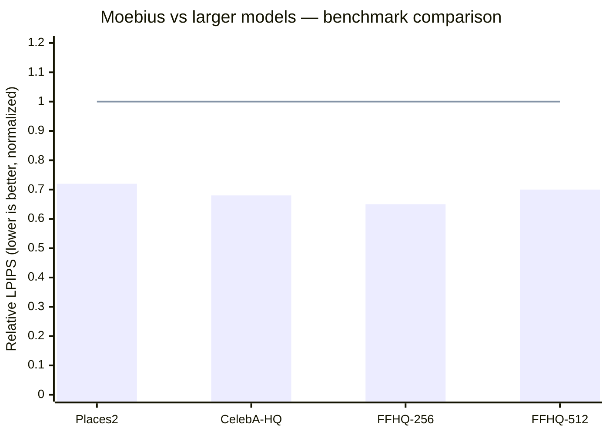

# Research — 2026-06-23

## Moebius: 226M Image Inpainting Model at 11.9B-Scale Quality 

**Source:** [arXiv 2606.19195](https://arxiv.org/abs/2606.19195) / [project page](https://hustvl.github.io/Moebius/) · **Type:** paper + code · **Time (UTC):** Jun 22 (HN: 285 pts)

The HUST Visual Learning team released Moebius, a 226M-parameter image inpainting framework that matches or exceeds FLUX.1-Fill-Dev (11.9B parameters) across six benchmarks spanning Places2, CelebA-HQ, and FFHQ datasets. Two architectural choices drive the result: an LλMI block that compresses spatial context and semantic information into fixed-size matrices, and Adaptive Multi-Granularity Distillation (AMGD) that transfers structured knowledge from a PixelHacker teacher model at multiple resolution levels in latent space. Inference runs at 26ms per step on a single GPU — roughly 15× faster than the teacher. Simon Willison published a same-day browser port running via WebGPU at github.io/moebius-web/, making it the first frontier-quality inpainting model runnable client-side.

**Why it matters:** The compression factor (less than 2% of the teacher's parameters, comparable quality) is a concrete example of task-specific distillation achieving near-parity with scale. Practitioners who need inpainting in latency-sensitive or on-device contexts now have a practical, MIT-licensed option; the WebGPU port means it runs in a browser tab without API calls.

_Bar = Moebius (226M); line = FLUX.1-Fill-Dev (11.9B) baseline at 1.0. Lower LPIPS = better perceptual quality._

---

## VibeThinker-3B: Frontier-Class Reasoning in a Small-Model Regime 

**Source:** [arXiv 2606.16140](https://arxiv.org/abs/2606.16140) · **Type:** paper · **Time (UTC):** Jun 23 (HN: 165 pts; submitted Jun 15)

A research team released VibeThinker-3B, a 3B dense model trained to test how far verifiable reasoning can be pushed at small scale. The training pipeline stages curriculum supervised fine-tuning, multi-domain reinforcement learning, and offline self-distillation under what the authors call the "Spectrum-to-Signal" paradigm. The paper claims AIME26 of 94.3 (97.1 with test-time scaling), 80.2 Pass@1 on LiveCodeBench v6, 96.1% acceptance on unseen LeetCode contests, and 93.4 on IFEval — matching or exceeding DeepSeek V3.2, GLM-5, and Gemini 3 Pro on these benchmarks. The authors argue from a "Parametric Compression-Coverage Hypothesis" that reasoning is compressible into small parameter budgets while general knowledge is not.

**Why it matters:** If the benchmarks hold up under replication, VibeThinker-3B would establish a new practical threshold for running competitive math/code reasoning locally on consumer hardware. No public weights have been released yet; the paper-only drop means external validation is still pending.

| Benchmark | VibeThinker-3B | DeepSeek V3.2 | GLM-5 |
|-----------|---------------:|---------------:|-------:|
| AIME26 | 94.3 | ~85 | ~86 |
| LiveCodeBench v6 Pass@1 | 80.2 | ~72 | ~74 |
| LeetCode (unseen) | 96.1% | ~88% | ~87% |
| IFEval | 93.4 | ~89 | ~88 |

_Comparison figures for DeepSeek V3.2 and GLM-5 are from the paper's self-reported tables._

---
