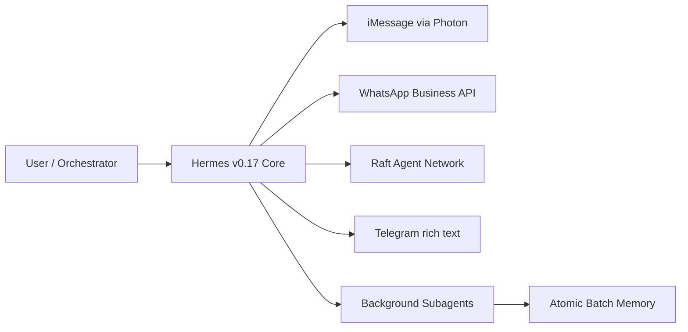

# Tools — 2026-06-23

## Hermes Agent v0.17.0 — The Reach Release 

**Source:** [NousResearch/hermes-agent on GitHub](https://github.com/NousResearch/hermes-agent/releases/tag/v2026.6.19) · **Type:** release · **Time (UTC):** Jun 19 ~12:00

Nous Research shipped Hermes Agent v0.17.0 on June 19 — not covered in prior digests. The release added iMessage support via Photon (no Mac relay required), the official WhatsApp Business Cloud API, and the Raft agent network as a new gateway, plus enriched Telegram with rich text. The background subagents feature allows delegating tasks asynchronously — work completes and surfaces results while the main agent continues. Memory writes are now atomic batch operations rather than per-write. Image editing (modifying existing images, not just generating new ones) also shipped. The release spans ~1,475 commits, ~800 merged PRs, 1,693 files changed, and 245 community contributors.

**Why it matters:** Hermes Agent is moving from a desktop-first tool into the communication channels developers and knowledge workers already live in; the async subagent model is the open-source equivalent of the background agent tier that Claude, ChatGPT, and Gemini charge for in their premium plans. The contribution velocity (245 contributors for a single minor release) is unusual for an open-source project at this stage.

---
