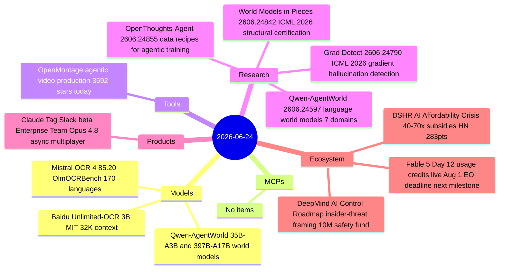

# AI Digest — 2026-06-24

> Anthropic launched Claude Tag, a Slack-native AI teammate powered by Opus 4.8 that handles asynchronous multi-day tasks for Enterprise and Team customers — the day's biggest product story. On the model front, Mistral OCR 4 topped OlmOCRBench at 85.20 across 170 languages at competitive pricing, and the Qwen team released language world models that learn to simulate agentic environments rather than only selecting actions. The broader theme is infrastructure maturity: David Rosenthal's "AI Affordability Crisis" analysis (283 HN points) laid bare the 40–70× subsidy ratios embedded in current AI pricing, while Fable 5's free-trial period expired at midnight UTC and usage credits moved to $10/$50 per million tokens on Day 12 of the export ban.

## Day at a glance



## Top stories

1. **Claude Tag: Anthropic's async Slack teammate launches in beta** — Replaces the Claude for Slack app with a shared, channel-persistent Opus 4.8 instance that accepts delegated tasks and completes them over hours or days; ambient mode proactively surfaces relevant information; 30-day migration window for existing users. [→ details](products.md#claude-tag)
2. **Mistral OCR 4 tops document extraction benchmarks** — 85.20 on OlmOCRBench, 93.07 on OmniDocBench, 170 languages, bounding-box + confidence metadata output, $2/1K pages batch pricing; available on SageMaker, Azure AI Foundry, and Mistral Studio. [→ details](models.md#mistral-ocr-4)
3. **AI's Affordability Crisis: the 40–70× subsidy math** — DSHR post (HN 283 pts) documents that current AI platform pricing hides 40–70× real costs; OpenAI burned $20.9B in 2025 while spending $5.73B on marketing; one company's costs jumped 7× the day Anthropic moved to token-based pricing. [→ details](ecosystem.md#ai-affordability-crisis)

## By the numbers

| Category   | Items | Highlight |
|------------|------:|-----------|
| Models     |     3 | Mistral OCR 4: 85.20 OlmOCRBench, $2/1K pages batch |
| MCPs       |     0 | — |
| Tools      |     1 | OpenMontage: +3,592 GitHub stars, agentic video production |
| Research   |     4 | Qwen-AgentWorld: world model outperforms frontier agents across 7 domains |
| Products   |     1 | Claude Tag: async Slack teammate, Opus 4.8, Enterprise/Team beta |
| Ecosystem  |     3 | Fable 5 Day 12 usage credits; DeepMind $10M safety fund; DSHR subsidy analysis |

## Timeline (UTC)

```mermaid
timeline
  title Releases and announcements
  Jun 11 : DeepMind and Schmidt Sciences 10M multi-agent safety fund announced
  Jun 18 : DeepMind AI Control Roadmap agents as insider threats published
  Jun 22 : Baidu Unlimited-OCR 3B MIT license repo live on GitHub
  Jun 23 00:00 : Fable 5 usage credits activate 10 and 50 per million tokens
  Jun 23 : Mistral OCR 4 released 85.20 OlmOCRBench 170 languages
           Anthropic launches Claude Tag beta Enterprise and Team Slack
           Baidu Unlimited-OCR arXiv paper published
           DSHR AI Affordability Crisis 40-70x subsidy analysis HN 283pts
  Jun 24 : Qwen-AgentWorld language world models paper and OSS models
           World Models in Pieces ICML 2026 structural certification
           OpenMontage agentic video production 3592 new GitHub stars
```

## Files
- [Models](models.md)
- [MCPs](mcps.md)
- [Tools](tools.md)
- [Research](research.md)
- [Products](products.md)
- [Ecosystem](ecosystem.md)
