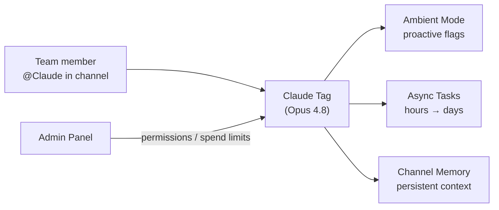

# Products — 2026-06-24

## Claude Tag — Anthropic's Slack-Native AI Teammate 

**Source:** [anthropic.com/news/introducing-claude-tag](https://www.anthropic.com/news/introducing-claude-tag) · **Type:** launch · **Time (UTC):** Jun 23

Anthropic launched Claude Tag in beta for Enterprise and Team customers. It replaces the earlier Claude for Slack integration and is invoked with `@Claude` in any Slack channel. A single Claude instance is shared across a channel (visible to all members), can accept delegated tasks with asynchronous completion over hours or days, and supports an optional ambient mode that proactively flags relevant information and unresolved action items without being explicitly addressed. The model backing Claude Tag is Opus 4.8. Admins control permissions, data scope, and per-workspace spending limits via a new admin panel. Existing Claude for Slack users have a 30-day migration window. Anthropic notes that internally, 65% of their product team's code is generated by their own version of Claude Tag. Expansion to platforms beyond Slack is planned.

**Why it matters:** Persistent, shared channel context and async task execution shift Claude from a query-response assistant to a background worker that can complete multi-hour tasks without blocking the human team — the first Anthropic product that operates as a peer rather than a tool. The 30-day migration window and introductory credits mean Enterprise users should expect a workflow change in the near term.

---
