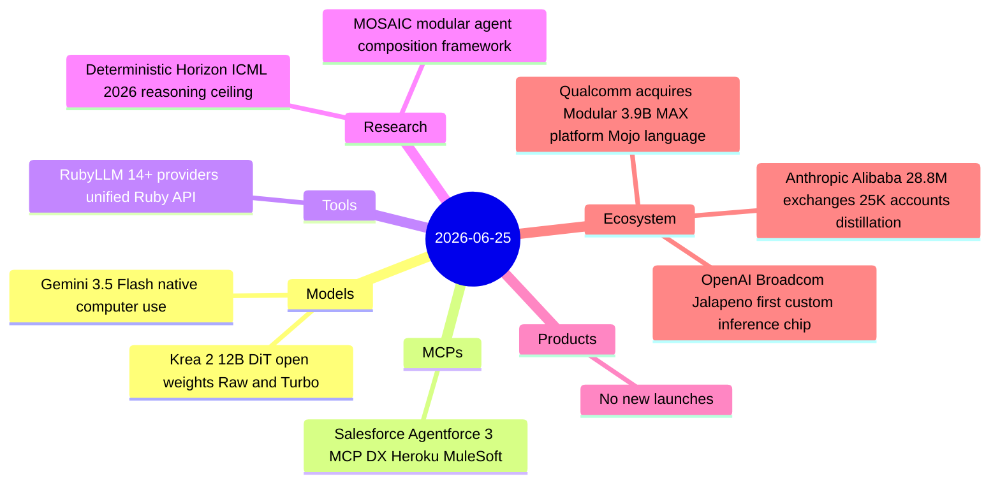
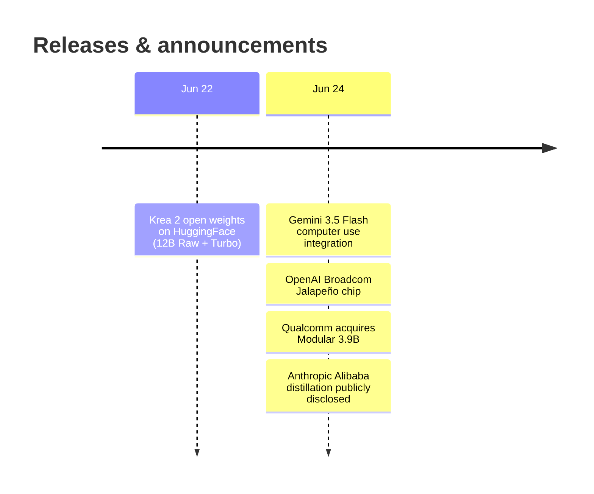

# AI Digest — 2026-06-25

> Anthropic publicly disclosed that operators affiliated with Alibaba's Qwen lab ran the largest known distillation attack against Claude — 28.8 million exchanges through 25,000 fraudulent accounts over 44 days, targeting software engineering and agentic reasoning capabilities. On the infrastructure front, OpenAI and Broadcom unveiled Jalapeño, OpenAI's first custom inference ASIC (built in nine months, initial deployment EOY 2026), while Qualcomm moved to acquire Modular for ~$3.9B to bring the MAX platform and Mojo language — a hardware-agnostic alternative to CUDA — under its roof. It was a lighter day for model releases, with the main items being Krea 2's 12B open-weight image model (Raw + Turbo variants) and Google folding computer use natively into Gemini 3.5 Flash.

## Day at a glance

## Top stories

1. **Anthropic accuses Alibaba of 28.8M-exchange distillation campaign** — Operators affiliated with Alibaba's Qwen lab systematically queried Claude through ~25,000 fake accounts over 44 days to harvest its software engineering and agentic reasoning capabilities; Anthropic disclosed the attack in a June 10 letter to the Senate Banking Committee that became public June 24. [→ details](ecosystem.md#anthropic-alibaba-distillation)
2. **OpenAI + Broadcom unveil Jalapeño inference chip** — OpenAI's first custom ASIC went from design to tape-out in nine months, targets inference-only workloads, and is claimed to beat current SOTA on performance-per-watt; initial deployment planned EOY 2026. [→ details](ecosystem.md#openai-jalapeno)
3. **Qualcomm acquires Modular for ~$3.9B** — Modular's MAX AI platform and Mojo language enable hardware-agnostic AI deployment across CPU/GPU/NPU without CUDA lock-in; Qualcomm frames this as a play for disaggregated multi-vendor AI infrastructure. [→ details](ecosystem.md#qualcomm-modular)

## By the numbers

| Category   | Items | Highlight |
|------------|------:|-----------|
| Models     |     2 | Krea 2 12B open weights, Gemini 3.5 Flash computer use |
| MCPs       |     1 | Salesforce Agentforce 3 with MCP-native servers |
| Tools      |     1 | RubyLLM 1.3.0, 14+ providers, 383 HN pts |
| Research   |     2 | ICML 2026: reasoning plateau + modular agent composition |
| Products   |     0 | — |
| Ecosystem  |     3 | Anthropic/Alibaba, Jalapeño chip, Qualcomm/Modular |

## Timeline (UTC)

## Files
- [Models](models.md)
- [MCPs](mcps.md)
- [Tools](tools.md)
- [Research](research.md)
- [Products](products.md)
- [Ecosystem](ecosystem.md)
