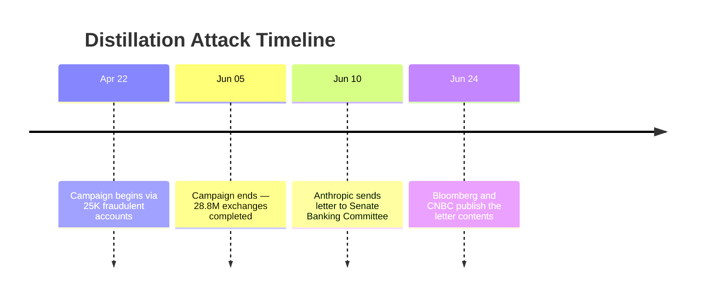
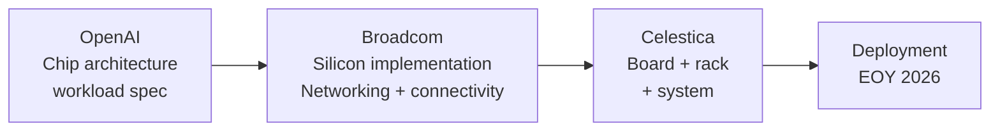

# Ecosystem — 2026-06-25

## Anthropic Accuses Alibaba of Largest Known Distillation Attack 

**Source:** [Bloomberg](https://www.bloomberg.com/news/articles/2026-06-24/anthropic-accuses-alibaba-of-illicitly-accessing-its-ai-models) · [CNBC](https://www.cnbc.com/2026/06/24/anthropic-alibaba-distillation-campaign.html) · [CybersecurityNews](https://cybersecuritynews.com/anthropic-accuses-alibaba/) · **Type:** disclosure · **Time (UTC):** Jun 24–25

In a letter dated June 10 and addressed to Senate Banking Committee Chair Tim Scott and Ranking Member Elizabeth Warren, Anthropic alleged that operators affiliated with Alibaba's Qwen AI lab ran a coordinated campaign against Claude from April 22 to June 5, 2026. The operation generated 28.8 million exchanges through approximately 25,000 fraudulent accounts — Anthropic's description of it as "the largest known distillation attack" on the company to date. The campaign specifically targeted Claude's highest-value capabilities: software engineering and agentic reasoning, the same capabilities central to the Mythos Preview model. Distillation in this context means systematically querying a model and using its outputs to train a competing system, bypassing the upstream lab's research costs. Bloomberg and CNBC published the contents of the letter on June 24, making the allegation public. Anthropic also noted a February 2026 incident involving DeepSeek and two other Chinese labs using similar methods; the Alibaba campaign is the escalation from that baseline.

**Why it matters:** The scale (28.8M exchanges, 25K accounts over 44 days) implies the campaign was systematic and resource-intensive, not opportunistic. For AI API operators, this is a concrete example of what coordinated capability extraction looks like at scale. Anthropic's decision to disclose via Senate Banking Committee rather than through courts signals a push for legislative or regulatory intervention on distillation as a trade practice.

---

## OpenAI + Broadcom Unveil Jalapeño: First Custom LLM Inference Chip 

**Source:** [openai.com/index/openai-broadcom-jalapeno-inference-chip](https://openai.com/index/openai-broadcom-jalapeno-inference-chip/) · [TechCrunch](https://techcrunch.com/2026/06/24/openai-unveils-its-first-custom-chip-built-by-broadcom/) · [Tom's Hardware](https://www.tomshardware.com/tech-industry/artificial-intelligence/broadcom-and-openai-unveil-custom-built-jalapeno-inference-processor-openais-first-chip-is-a-massive-reticle-sized-asic-built-in-an-ultra-fast-nine-month-development-cycle) · **Type:** announcement · **Time (UTC):** Jun 24

OpenAI and Broadcom announced Jalapeño, OpenAI's first custom silicon — an ASIC built specifically for LLM inference rather than training. Development ran from initial design to manufacturing tape-out in nine months, which the companies describe as possibly the fastest ASIC development cycle ever achieved in high-performance advanced semiconductors; that speed came from co-development with OpenAI engineering teams, Broadcom's implementation expertise, and using OpenAI models to accelerate parts of the design and optimization process. Early testing shows better performance-per-watt than current SOTA, though specific numbers were not disclosed. The chip is inference-only: Nvidia GPUs remain the platform for training. The partnership involves three parties — OpenAI (chip architecture and workload specification), Broadcom (silicon implementation, networking, connectivity), and Celestica (board, rack, and system integration). Initial deployment is targeted for end of 2026, with a multi-generation platform planned. The chip carries 688 Hacker News points as of June 24.

**Why it matters:** Inference economics are the primary cost driver for frontier AI services; a custom chip that delivers materially better performance-per-watt directly reduces OpenAI's cost structure and could enable lower API pricing. The move mirrors Google's TPU and Amazon's Trainium/Inferentia strategies and signals that OpenAI is now operating as a full-stack infrastructure company rather than a pure software/model layer.

---

## Qualcomm Acquires Modular for ~$3.9 Billion 

**Source:** [investor.qualcomm.com](https://investor.qualcomm.com/news-events/press-releases/news-details/2026/Qualcomm-to-Acquire-Modular/default.aspx) · [CNBC](https://www.cnbc.com/2026/06/24/qualcomm-ai-chip-modular-software.html) · [TechStartups](https://techstartups.com/2026/06/24/qualcomm-acquires-ai-startup-modular-in-4-billion-deal-to-challenge-nvidias-cuda-dominance/) · **Type:** acquisition · **Time (UTC):** Jun 24

Qualcomm announced an agreement to acquire Modular, maker of the MAX AI platform and the Mojo programming language, for approximately $3.9 billion. Modular's MAX platform provides hardware-agnostic AI deployment — a single model can be compiled and optimized for CPUs, GPUs, NPUs, or custom ASICs from different vendors without a rewrite. Qualcomm CEO Cristiano Amon framed the deal as a response to industry movement "toward disaggregated, multi-vendor architectures that demand a more open and modern software foundation." The deal structure involves Qualcomm issuing up to 19.2 million shares to Modular shareholders; close is expected in H2 2026 pending regulatory and shareholder approvals. Modular also created the Mojo programming language, which compiles Python-compatible code to native performance across hardware targets — a deliberate alternative to the CUDA ecosystem that locks workloads to Nvidia hardware.

**Why it matters:** CUDA lock-in is one of the clearest structural advantages Nvidia holds in the AI infrastructure market. Qualcomm absorbing a platform specifically designed to break that dependency — and doing so with Mojo, a language that looks like Python to developers — is a direct strategic counter. For AI infrastructure engineers, MAX + Qualcomm silicon could eventually offer a credible non-Nvidia deployment path for inference workloads, particularly at edge and mobile scales where Qualcomm already dominates.

---
