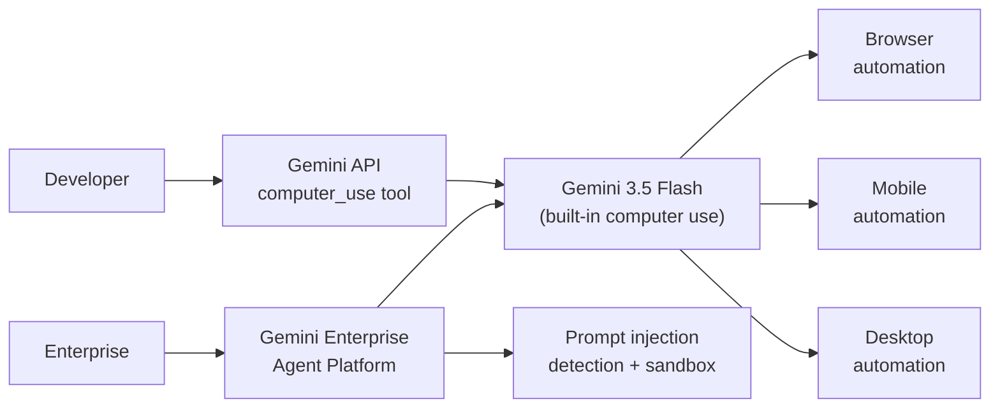

# Models — 2026-06-25

## Krea 2 Open Weights (12B DiT, Raw + Turbo) 

**Source:** [krea.ai/krea-2-open-source](https://www.krea.ai/krea-2-open-source) · [krea.ai/blog/krea-2-technical-report](https://www.krea.ai/blog/krea-2-technical-report) · **Type:** release · **Time (UTC):** Jun 22

Krea released open weights for Krea 2 Raw and Krea 2 Turbo on Hugging Face on June 22. The model is a 12B-parameter single-stream Diffusion Transformer (DiT) built from scratch with grouped-query attention (GQA), sigmoid-gated attention, zero-centered RMSNorm with QKNorm, and Qwen 3 VL as its text encoder. The two released variants differ in distillation state: Raw is the undistilled base checkpoint for LoRA fine-tuning and domain adaptation; Turbo is an 8-step distilled checkpoint targeting 1K–2K resolution generation. On the Artificial Analysis text-to-image leaderboard the model ranks among the top ten overall and second among independent labs. Training excluded all AI-generated images — the team's argument is that synthetic data introduces quality ceilings that compound across generations. Six training stages ran on a custom Kubernetes stack with 30-second checkpoint intervals across 208 TB of metadata.

**Why it matters:** A 12B-parameter open-weight image model at top-10 quality with a permissive license gives fine-tuning practitioners a high-quality base for domain-specific variants (advertising, architecture, automotive) without an API dependency. The Raw variant in particular fills a gap between tiny (flux-schnell) and inaccessible (closed API) checkpoints.

| Variant | Parameters | Steps | Resolution | Use case |
|---------|:----------:|:-----:|:----------:|----------|
| K2 Raw | 12B | Full | 1K–2K | Fine-tuning / LoRA training |
| K2 Turbo | 12B | 8 | 1K–2K | Fast inference |

**License:** Permissive for individuals and teams under ~50 seats; commercial enterprise tier required for large organizations.

---

## Gemini 3.5 Flash — Computer Use Natively Integrated 

**Source:** [blog.google — Introducing computer use in Gemini 3.5 Flash](https://blog.google/innovation-and-ai/models-and-research/gemini-models/introducing-computer-use-gemini-3-5-flash/) · **Type:** update · **Time (UTC):** Jun 24

Google announced on June 24 that computer use is now a built-in tool in Gemini 3.5 Flash — previously it existed only as a separate standalone Gemini computer-use model. The capability lets developers build agents that perceive screen state and issue keyboard/mouse actions across browser, mobile, and desktop environments. Access paths include the Gemini API (direct tool invocation) and the Gemini Enterprise Agent Platform for managed deployment. Google reports OSWorld benchmark improvements over the prior standalone model, though exact numbers were not disclosed. Safety additions include targeted adversarial training, prompt injection detection, sandboxing, and optional human-confirmation checkpoints for sensitive actions. Chrome simultaneously gained a "Select from screen" mode in Gemini that shares the same computer-use backend.

**Why it matters:** Folding computer use into a general-purpose flash model means existing Gemini API integrations can add GUI automation without switching to a specialized endpoint. The enterprise safeguard system (injection detection + sandbox + human-in-loop) addresses the main blockers that have prevented production deployments of computer-use agents in regulated environments.

---
