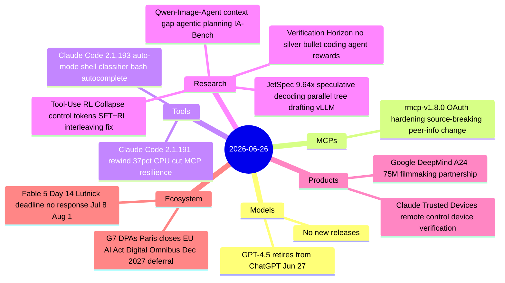

# AI Digest — 2026-06-26

> Day 14 of the Fable 5 export ban saw the House bipartisan deadline for Commerce Secretary Lutnick's written justification pass without any public response; July 8 (Anthropic identity verification) and August 1 (Executive Order 60-day deadline) are now the next structural milestones. Claude Code received two releases this week — 2.1.191 cuts CPU streaming overhead by ~37% and adds `/rewind`, while 2.1.193 (today) lands full auto-mode shell classification and live bash path autocomplete. Four research papers trending on HuggingFace today include JetSpec, which achieves up to 9.64× speculative decoding speedup via parallel tree drafting with vLLM integration. The G7 DPA Paris summit closed today, coinciding with the EU AI Act Digital Omnibus — formally endorsed by the European Parliament on June 16 — which defers high-risk Annex III obligations 16 months to December 2027.

## Day at a glance



## Top stories

1. **Fable 5 Day 14: Congressional deadline passed, Commerce still silent** — Four bipartisan House members demanded Lutnick's written Fable 5 justification by today; no public response materialized. Next milestones: July 8 (Anthropic ID verification policy) and August 1 (EO 60-day frontier model framework deadline). [→ details](ecosystem.md#fable5-day14)
2. **JetSpec: 9.64× speculative decoding speedup via parallel tree drafting** — A new causal parallel draft head breaks the prior scaling ceiling on speculative decoding, delivering 9.64× on MATH-500 and 4.58× on conversational tasks, with vLLM integration across dense and MoE Qwen3 models. [→ details](research.md#jetspec)
3. **EU AI Act Digital Omnibus: high-risk enforcement deferred 16 months** — European Parliament endorsed the Omnibus on June 16; formal adoption expected July 2026; Annex III high-risk obligations shift from August 2, 2026 to December 2, 2027. G7 DPA summit closed today. [→ details](ecosystem.md#eu-ai-act-omnibus)

## By the numbers

| Category   | Items | Highlight |
|------------|------:|-----------|
| Models     |     0 | GPT-4.5 retires from ChatGPT June 27 (API unaffected) |
| MCPs       |     1 | rmcp-v1.8.0: OAuth issuer validation + source-breaking API change |
| Tools      |     2 | Claude Code 2.1.193: full auto-mode shell classifier |
| Research   |     4 | JetSpec: up to 9.64× speculative decoding speedup |
| Products   |     2 | Claude Trusted Devices; Google DeepMind + A24 $75M |
| Ecosystem  |     2 | Fable 5 Day 14; EU AI Act Omnibus deferral |

## Timeline (UTC)

```mermaid
timeline
  title Releases & announcements
  Jun 22 : Google DeepMind A24 75M filmmaking partnership
  Jun 23 12:29 : rmcp-v1.8.0 OAuth hardening Rust MCP SDK
  Jun 25 : Claude Code 2.1.191 rewind 37pct CPU cut
  Jun 25 : Claude Trusted Devices remote control verification
  Jun 26 : Claude Code 2.1.193 auto-mode shell classifier
  Jun 26 : JetSpec Verification-Horizon Tool-RL-Collapse Qwen-Image-Agent
  Jun 26 : Fable 5 Day 14 Lutnick deadline passed no response
```

## Files
- [Models](models.md)
- [MCPs](mcps.md)
- [Tools](tools.md)
- [Research](research.md)
- [Products](products.md)
- [Ecosystem](ecosystem.md)
