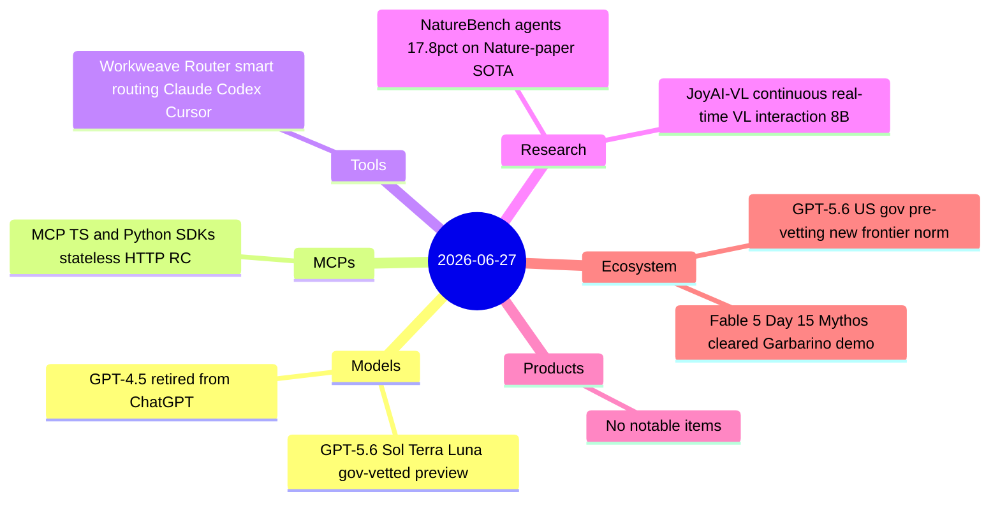
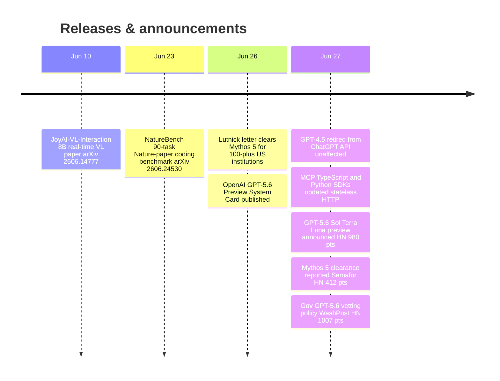

# AI Digest — 2026-06-27

> US government partially lifted the Fable 5 export controls on Day 15, clearing Mythos 5 for deployment to 100+ vetted critical infrastructure organizations — the same day a congressional briefing showed the model autonomously executing a simulated bank-account drain. OpenAI simultaneously announced the GPT-5.6 series (Sol, Terra, Luna) exclusively to US government-pre-cleared trusted partners, establishing a new pattern of coordinated access control at the frontier. On the tooling side, MCP's TypeScript and Python SDKs updated June 27 to implement the stateless HTTP core from the May RC spec, removing session IDs from the protocol and enabling plain round-robin load balancing for MCP servers.

## Day at a glance

## Top stories

1. **Mythos 5 restored for 100+ US critical infrastructure orgs** — Commerce Secretary Lutnick's June 26 letter permits Mythos 5 redeployment to vetted Fortune 500 companies and agencies; House Homeland Security chair Garbarino's prior demo showed Mythos autonomously executing a simulated bank-account drain and patching the flaw. Fable 5 general access remains offline. [→ details](ecosystem.md#fable5-day15)
2. **OpenAI previews GPT-5.6 under government-vetted access** — Three variants (Sol: flagship, Terra: everyday, Luna: budget) are accessible only to a "small group of trusted partners" whose participation has been shared with the US government before launch — the first major model launch structured around pre-approved access. [→ details](models.md#gpt-56-preview)
3. **MCP SDKs ship stateless HTTP support** — June 27 updates to the official TypeScript and Python SDKs implement the 2026-07-28 RC's session-ID-free protocol, `Mcp-Method` header routing, and Tasks extension — enabling MCP servers behind plain round-robin load balancers for the first time. [→ details](mcps.md#mcp-sdk-stateless)

## By the numbers

| Category   | Items | Highlight |
|------------|------:|-----------|
| Models     |     2 | GPT-5.6 Sol: $5/$30 per MTok; first gov-pre-cleared model launch |
| MCPs       |     1 | SDK updates ship stateless HTTP and Tasks extension from May RC |
| Tools      |     1 | Workweave Router: 40–70% cost reduction via per-request routing |
| Research   |     2 | NatureBench: frontier agents pass SOTA on only 17.8% of Nature tasks |
| Products   |     0 | — |
| Ecosystem  |     2 | Mythos 5 for 100+ US orgs; GPT-5.6 gov-vetting framework |

## Timeline (UTC)

## Files
- [Models](models.md)
- [MCPs](mcps.md)
- [Tools](tools.md)
- [Research](research.md)
- [Products](products.md)
- [Ecosystem](ecosystem.md)
