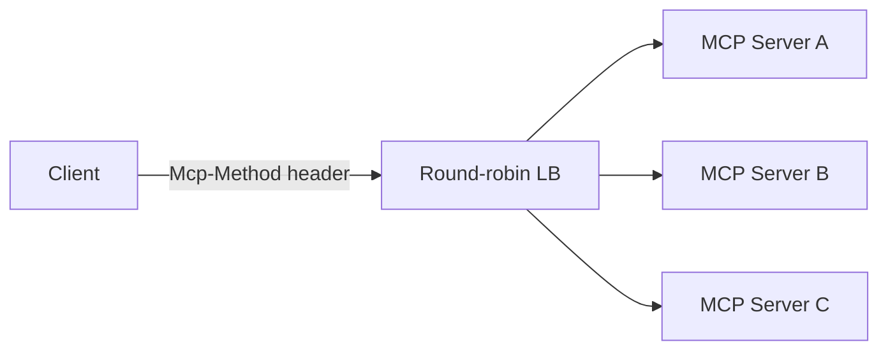

# MCPs — 2026-06-27

## MCP TypeScript and Python SDKs — Stateless HTTP Implemented 

**Source:** [MCP Blog RC post](https://blog.modelcontextprotocol.io/posts/2026-07-28-release-candidate/) · **Type:** update · **Time (UTC):** —

Both the official TypeScript and Python SDKs for Model Context Protocol received updates on June 27, implementing the key changes from the 2026-07-28 Release Candidate (the RC itself was published May 21). The final specification ships July 28; SDK releases are part of a ten-week maintainer validation window.

The headline protocol change: the `Mcp-Session-Id` header and the protocol-level `initialize` handshake are removed. MCP requests carry protocol version and client identity in a `_meta` field on every call, and gateway-level routing uses an `Mcp-Method` header instead of sticky sessions.

Additional changes in the June 27 SDK releases:

- **Tasks extension** — long-running operations now return a task handle on `tools/call`; clients drive execution via `tasks/get`, `tasks/update`, and `tasks/cancel` instead of waiting on a single blocking response.
- **MCP Apps** — servers can ship interactive HTML UIs that hosts render in a sandboxed iframe; all UI-triggered actions route through the standard JSON-RPC base protocol.
- **OAuth/OIDC alignment** — validates the `iss` parameter per RFC 9207; clearer guidance on dynamic client registration.
- **Formal deprecation policy** — features now transition through Active → Deprecated → Removed states with a minimum 12-month window between each phase.

**Why it matters:** Stateless HTTP is the change that makes MCP viable at scale. Any cloud-native deployment previously blocked by sticky-session requirements (Kubernetes ingress, Lambda, Cloud Run) can now run behind a plain round-robin load balancer. The Tasks extension resolves the long-running operation problem that prior spec versions left to individual implementers.

---
