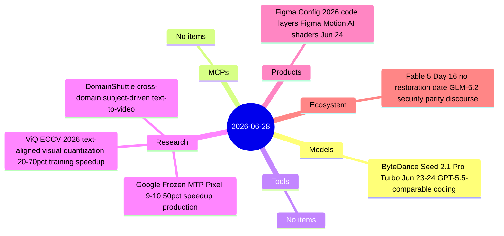
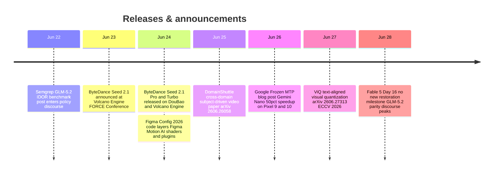

# AI Digest — 2026-06-28

> A quiet Sunday (Day 16 of the Fable 5 export ban) with no major model or platform launches from US labs. The week's headline catch-up: ByteDance Seed 2.1 Pro landed June 23–24 with GPT-5.5-comparable coding and agent capabilities but went uncovered in the daily digests; Figma's Config 2026 similarly slipped through with its most developer-facing feature set ever — code layers, native animation, and MCP-compatible motion exports. On the policy front, Semgrep's June 22 GLM-5.2 security evaluation is now circulating in policy circles as evidence that the Fable 5 export control may not be containing the capability it targeted: an MIT-licensed Chinese open-weight model outperforms Claude Code on IDOR detection sixteen days after the ban.

## Day at a glance

## Top stories

1. **ByteDance Seed 2.1 Pro: GPT-5.5-comparable agent and coding model** — Released June 24 at Volcano Engine FORCE Conference; #8 on Code Arena Frontend (1539, near Claude Opus 4.6) and top on GDPVal for agent tasks. Not previously covered. [→ details](models.md#bytedance-seed-21)
2. **Figma Config 2026: code layers, motion, and MCP-compatible animations** — Code layers collapse the design-to-dev handoff; Figma Motion adds a native keyframe timeline with CSS/React/MP4/WebM export; animations are MCP-compatible for direct coding-agent ingestion. [→ details](products.md#figma-config-2026)
3. **Fable 5 Day 16: GLM-5.2 security evaluation enters policy discourse** — Semgrep's June 22 harness shows GLM-5.2 (MIT-licensed, Chinese, open-weight) outscoring Claude Code on IDOR detection, accelerating the argument that the export ban may not contain the targeted capability. [→ details](ecosystem.md#fable5-day16)

## By the numbers

| Category   | Items | Highlight |
|------------|------:|-----------|
| Models     |     1 | Seed 2.1 Pro: 1539 Code Arena Frontend, top GDPVal |
| MCPs       |     0 | — |
| Tools      |     0 | — |
| Research   |     3 | Google Frozen MTP: 50%+ production speedup on Pixel 9/10 |
| Products   |     1 | Figma Config 2026: code layers + Figma Motion (MCP-compatible) |
| Ecosystem  |     1 | Fable 5 Day 16: GLM-5.2 IDOR benchmark in policy debate |

## Timeline (UTC)

## Files
- [Models](models.md)
- [MCPs](mcps.md)
- [Tools](tools.md)
- [Research](research.md)
- [Products](products.md)
- [Ecosystem](ecosystem.md)
