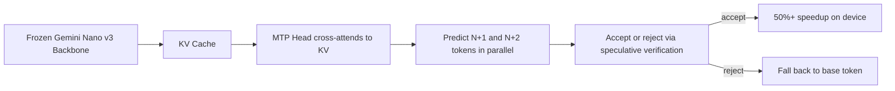

# Research — 2026-06-28

## Google Frozen MTP: 50%+ inference speedup on production Pixel devices 

**Source:** [Google Research Blog](https://research.google/blog/accelerating-gemini-nano-models-on-pixel-with-frozen-multi-token-prediction/) · **Type:** technique + deployment · **Time (UTC):** Jun 26

Google published a blog post describing how they retrofit Multi-Token Prediction (MTP) onto fully frozen Gemini Nano v3 models already deployed to Pixel 9 and 10 phones. Rather than maintaining a separate drafter model, a lightweight Transformer MTP head is appended to the backbone's final layers and cross-attends directly to its existing KV cache — eliminating drafter prefill latency and saving 130 MB per instance versus standalone drafters. The system is production-live on Pixel 9/10, powering AI Notification Summaries and Proofread. Token outputs are bit-for-bit identical to the base model; on real workloads the head correctly predicts an average of nearly two additional tokens per inference pass. Speedups of 50% or more are reported against standalone drafters of comparable size, with up to 55% improvement in token acceptance on predictable text structures.

**Why it matters:** This demonstrates MTP retrofitting as a zero-quality-loss inference optimization for frozen production models — no fine-tuning of the backbone required — suggesting the technique is broadly applicable to any already-deployed edge LLM.

---

## ViQ: Text-Aligned Visual Quantization at Any Resolution 

**Source:** [arXiv 2606.27313](https://arxiv.org/abs/2606.27313) · **Type:** paper · **Time (UTC):** Jun 27

Tencent Hunyuan researchers submitted ViQ to ECCV 2026, proposing a visual quantization framework that balances semantic richness and detail preservation in discrete visual representations while supporting native-resolution inputs. Two core innovations: a proximal representation learning strategy that progressively compacts the feature space toward text-aligned semantics, and a position-aware head-wise quantization mechanism that handles arbitrary resolutions without fixed-resolution assumptions. Multimodal training with ViQ representations yields 20–70% wall-clock acceleration across different base LLMs and training recipes compared to standard dense visual tokens.

**Why it matters:** Native-resolution discrete visual tokens with text-space alignment reduce both memory footprint and training compute for vision-language models — directly addressing the cost of multimodal pretraining at scale.

---

## DomainShuttle: Cross-Domain Subject-Driven Text-to-Video 

**Source:** [arXiv 2606.26058](https://arxiv.org/abs/2606.26058) · **Type:** paper · **Time (UTC):** Jun 24–25

DomainShuttle from Nankai University and collaborators proposes a subject-driven text-to-video generation framework that preserves subject identity across in-domain (same visual style) and cross-domain (differing visual styles) scenarios. A domain-aware modeling strategy disentangles subject appearance from environmental context, enabling the same subject to be rendered in "anime," "watercolor," or photorealistic styles within a single inference pipeline. The method achieves competitive fidelity and style-transfer results across evaluation benchmarks without requiring domain-specific fine-tuning.

**Why it matters:** Subject-driven video generation that handles open-domain style variation opens practical paths for IP-preserving content production across creative and commercial video workflows.

---
