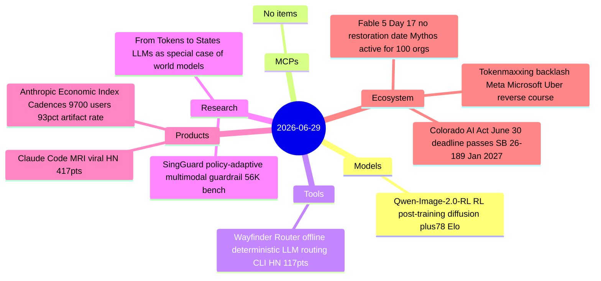

# AI Digest — 2026-06-29

> A quiet Sunday (Day 17 of the Fable 5 export ban) with no major model or platform launches. The signal story is Anthropic's Economic Index "Cadences" report (released June 26, first coverage here): cross-referencing ~9,700 users' survey answers against their actual Claude session logs, it finds 93% of conversations produce durable artifacts and more than a third expect AI to handle "most tasks" within 12 months. Simultaneously, tokenmaxxing culture reversed: Meta removed its internal token leaderboard, Microsoft cancelled Claude Code subscriptions across product divisions, and Uber disclosed it burned its entire 2026 token budget by April — signaling that undifferentiated token spend is entering a rationalization phase. Colorado's original AI Act enforcement date passes tomorrow without effect, superseded by the May 2026 replacement law that shifts obligations to January 2027.

## Day at a glance



## Top stories

1. **Anthropic Economic Index "Cadences": 93% of Claude sessions produce artifacts** — The June 26 report links 9,700 user surveys to actual session data via CLIO, finding that 93% of conversations yield identifiable outputs (documents, code, explanations) and over a third of respondents expect AI to handle most of their work tasks within 12 months; the heaviest automatic-mode users are *more* optimistic about career outcomes than collaborative users. [→ details](products.md#anthropic-economic-index-cadences)
2. **Tokenmaxxing backlash: Meta, Microsoft, and Uber pull back** — A trending 12gramsofcarbon analysis (HN 146 pts) consolidates a visible pattern: Meta removed its internal token leaderboard, Microsoft cancelled Claude Code subscriptions in key product divisions, and Uber burned its 2026 token budget by April; signals AI spend is entering a ROI-specificity phase. [→ details](ecosystem.md#tokenmaxxing-backlash)
3. **Colorado AI Act: original June 30 enforcement date passes without effect** — SB 24-205 was repealed by SB 26-189 (signed May 14, 2026), replacing EU-style high-risk obligations with a disclosure-and-rights framework effective January 1, 2027; marks the clearest US federal-state AI regulatory preemption case yet. [→ details](ecosystem.md#colorado-ai-act-june30)

## By the numbers

| Category   | Items | Highlight |
|------------|------:|-----------|
| Models     |     1 | Qwen-Image-2.0-RL: +78 Elo T2I, +93 editing via GRPO |
| MCPs       |     0 | — |
| Tools      |     1 | Wayfinder Router: sub-ms offline routing, zero model calls |
| Research   |     2 | SingGuard: SOTA across 35 datasets; Tokens→States: LLMs as world models |
| Products   |     2 | Economic Index: 93% artifact rate; MRI use case 417 HN pts |
| Ecosystem  |     3 | Fable 5 Day 17; tokenmaxxing reversal; Colorado AI Act |

## Timeline (UTC)

```mermaid
timeline
  title Releases and announcements
  00:00 : Fable 5 Day 17 begins no restoration date
  ~12:00 : GLM 5.2 Semgrep post peaks 801 HN points : Claude Code MRI essay 417 HN points
  ~14:00 : Wayfinder Router HN 117 points : Tokenmaxxing is dead HN 146 points
```

## Files
- [Models](models.md)
- [MCPs](mcps.md)
- [Tools](tools.md)
- [Research](research.md)
- [Products](products.md)
- [Ecosystem](ecosystem.md)
