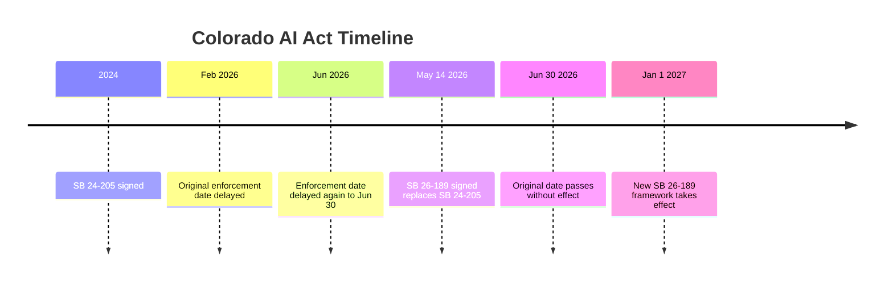

# Ecosystem — 2026-06-29

## Fable 5 Day 17: still offline, Mythos 5 active for ~100 US critical infrastructure orgs 

**Source:** [TechTimes](https://www.techtimes.com/articles/319213/20260628/claude-fable-5-still-offline-us-clears-mythos-5-critical-infrastructure.htm) · [CNBC](https://www.cnbc.com/2026/06/26/us-government-anthropic-claude-mythos5-ai.html) · **Type:** update · **Time (UTC):** —

No change from Day 16. Claude Fable 5 remains globally suspended under the June 12 US export-control directive. Mythos 5 (the unrestricted security-focused variant) has been cleared for approximately 100 vetted US organizations operating and defending critical infrastructure, per Commerce Secretary Lutnick's June 26 letter. Anthropic states it is "continuing to work with the government to expand access to Mythos 5 and make Fable 5 available for general use again" but has not provided a restoration date. The August 1 Executive Order 60-day deadline — requiring a Commerce-led framework for frontier model evaluation and controlled release — remains the next structural milestone.

Next milestones: August 1 (EO 60-day deadline), ongoing Anthropic identity verification policy (July 8).

_For the original coverage and NSA breach background, see [2026-06-22/ecosystem.md](../2026-06-22/ecosystem.md#fable5-day10) and [2026-06-27/ecosystem.md](../2026-06-27/ecosystem.md#fable5-day15)._

---

## Tokenmaxxing backlash: Meta, Microsoft, and Uber pull back on token-consumption culture 

**Source:** [12gramsofcarbon.com](https://12gramsofcarbon.com/p/agentics-tech-things-tokenmaxxing) · [Fortune](https://fortune.com/2026/05/28/tokenmaxxing-is-dead-companies-didnt-get-the-roi-from-ai-they-wanted-to-see/) · [HN discussion, 146 pts](https://news.ycombinator.com/item?id=48708795) · **Type:** analysis · **Time (UTC):** —

A 12gramsofcarbon newsletter post titled "Tokenmaxxing is dead, long live tokenmaxxing" surfaces today on HN (146 pts), consolidating a pattern that has been building since May: enterprises that introduced token-consumption leaderboards and metrics as AI productivity proxies are reversing course. Specific data points: Meta quietly removed its internal tokenmaxxing leaderboard after it was circulating on employee news sites; Microsoft cancelled Claude Code enterprise subscriptions in "several key product divisions"; Uber disclosed it burned through its entire 2026 token budget in the first four months of the year. The author argues this is a trough-of-disillusionment moment for undifferentiated tokenmaxxing, not the end of agentic AI, and that teams building continuous 24/7 agent infrastructure are still expanding usage.

**Why it matters:** Token spend as a productivity proxy was always a lagging indicator, but its rise created real enterprise budget commitments. The reversal signals that AI infrastructure spend is entering a rationalization phase where ROI specificity matters — which should accelerate demand for per-task cost attribution tooling (routers, caches, agent orchestrators with cost metering).

---

## Colorado AI Act: original June 30 enforcement date passes, replaced law takes effect January 2027 

**Source:** [Colorado General Assembly SB 26-189](https://leg.colorado.gov/bills/sb24-205) · [Brownstein analysis](https://www.bhfs.com/insight/colorados-landmark-ai-law-coming-online-what-developers-and-deployers-should-know/) · [Carpe Datum Law](https://www.carpedatumlaw.com/2026/05/colorados-ai-reset-two-weeks-a-white-house-callout-and-a-pivot-away-from-the-eu-model/) · **Type:** policy · **Time (UTC):** —

Tomorrow, June 30, 2026, was the original enforcement date for Colorado's SB 24-205 — the first comprehensive US state AI law, modeled loosely on the EU AI Act. It will pass without triggering any obligations. Governor Polis signed Senate Bill 26-189 on May 14, 2026, which repeals SB 24-205 entirely and replaces it with a narrower disclosure-and-rights framework for automated decision-making technology, effective January 1, 2027. The path to repeal was shaped by three simultaneous pressures: a December 2025 White House EO naming SB 24-205 as a law that would "force AI models to produce false results"; a DOJ AI Litigation Task Force intervention in xAI's challenge to the original law; and a federal magistrate stay pending that litigation.

**Why it matters:** Colorado's reversal is the clearest US case study of federal-state AI regulatory preemption in action. Developers targeting US compliance should note: the new SB 26-189 framework is primarily disclosure and automated decision-making rights, not the EU AI Act-style high-risk system obligations that SB 24-205 would have imposed.

---
