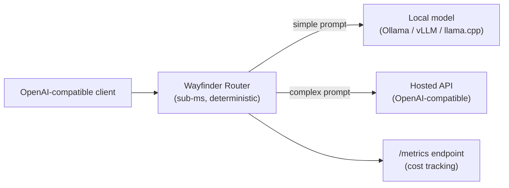

# Tools — 2026-06-29

## Wayfinder Router: offline deterministic LLM routing between local and hosted models 

**Source:** [github.com/itsthelore/wayfinder-router](https://github.com/itsthelore/wayfinder-router) · [HN discussion](https://news.ycombinator.com/item?id=48704373) · **Type:** release · **Time (UTC):** —

Wayfinder Router is a CLI tool that routes each prompt to either a local model (Ollama, LM Studio, vLLM, llama.cpp) or a hosted OpenAI-compatible endpoint without making a model call to decide. The routing decision is deterministic and sub-millisecond: it scores prompt structure (length, complexity markers) and optionally reads lexical cues like math or constraint keywords, then compares against a calibrated threshold. Cost is tracked as metadata on a `/metrics` endpoint but never enters the per-request decision. The tool exposes an OpenAI-compatible passthrough so existing clients need no code changes.

**Why it matters:** Most LLM routers add latency and cost by calling a judge model. Wayfinder's offline, zero-latency approach is useful for rate-limit overflow, privacy (local routing for sensitive prompts), and cost control in CI pipelines. HN discussion (117 pts) identified the key limitation: context preservation across model switches within a conversation requires the caller to manage state manually.

---
