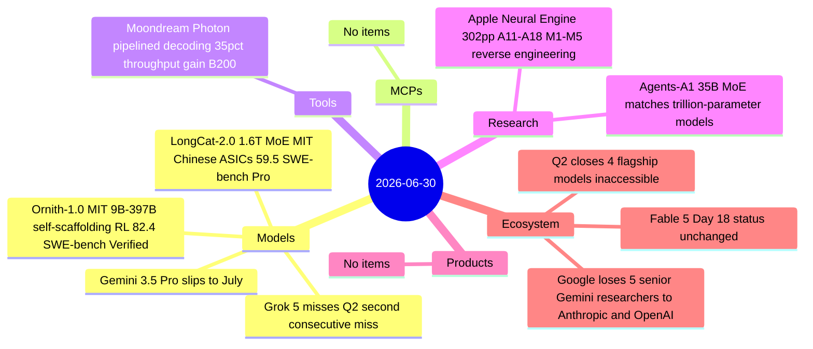

# AI Digest — 2026-06-30

> Q2 2026 closes today with an unprecedented access freeze at the frontier: Grok 5 missed its second consecutive quarterly deadline (now targeting Q3), Fable 5 remains suspended on Day 18, Gemini 3.5 Pro slipped its Google I/O promise to mid-July, and GPT-5.6 Sol is available only to roughly 20 government-vetted organizations. Against that backdrop, the day's clearest positive development is Meituan open-sourcing LongCat-2.0 — the 1.6T-parameter model that spent two months leading OpenRouter anonymously as "Owl Alpha" — MIT-licensed and trained entirely on Chinese AI ASICs with no NVIDIA hardware at any stage. On the research side, the Agents-A1 paper shows a 35B MoE matching trillion-parameter-class models on agent benchmarks by scaling training-horizon length rather than model size.

## Day at a glance



## Top stories

1. **LongCat-2.0: Meituan open-sources its 1.6T-parameter model trained on Chinese ASICs** — The model that spent two months leading OpenRouter as anonymous "Owl Alpha" is now MIT-licensed and publicly available; 59.5 SWE-bench Pro at scale, trained without any NVIDIA hardware. [→ details](models.md#longcat-20)
2. **Q2 2026 closes with four frontier models simultaneously locked or unavailable** — Grok 5 misses a second consecutive quarterly deadline; Fable 5 remains suspended (Day 18); Gemini 3.5 Pro slipped from Google's public June commitment; GPT-5.6 Sol is government-only. Open source is picking up the slack. [→ details](ecosystem.md#q2-frontier-access)
3. **Agents-A1: 35B MoE reaches trillion-parameter-level agent performance via long-horizon training** — 45K-token average trajectories and multi-teacher domain distillation produce a model that beats Kimi-K2.6 and DeepSeek-V4-pro on SEAL-0, IFBench, and FrontierScience-Olympiad at a fraction of the parameter count. [→ details](research.md#agents-a1)

## By the numbers

| Category   | Items | Highlight |
|------------|------:|-----------|
| Models     |     4 | LongCat-2.0: 1.6T MoE, MIT license, 59.5 SWE-bench Pro |
| MCPs       |     0 | — |
| Tools      |     1 | Moondream Photon: up to 35% decode throughput gain on B200 |
| Research   |     2 | Agents-A1: 35B outperforms trillion-param models on agent tasks |
| Products   |     0 | — |
| Ecosystem  |     3 | Q2 closes with 4 frontier models inaccessible; Google talent exodus |

## Timeline (UTC)

```mermaid
timeline
  title Releases and announcements
  Jun 25 : Ornith-1.0 released deepreinforce-ai MIT agentic coding 4 model sizes
  Jun 29 : Agents-A1 paper submitted arXiv 2606.30616
  Jun 30 00:00 : LongCat-2.0 open-sourced Meituan 1.6T MoE MIT
  Jun 30 23:59 : Q2 2026 closes Grok 5 and Gemini 3.5 Pro unreleased Fable 5 suspended
```

## Files
- [Models](models.md)
- [MCPs](mcps.md)
- [Tools](tools.md)
- [Research](research.md)
- [Products](products.md)
- [Ecosystem](ecosystem.md)
