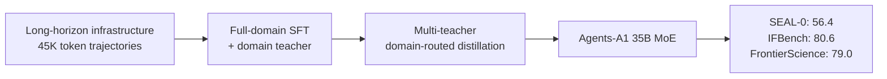

# Research — 2026-06-30

## Agents-A1: scaling agent horizon outperforms scaling parameters 

**Source:** [arXiv 2606.30616](https://arxiv.org/abs/2606.30616) · **Type:** paper · **Time (UTC):** submitted Jun 29

The Agents-A1 paper demonstrates that a 35-billion-parameter mixture-of-experts model can reach performance comparable to trillion-parameter-class models by scaling training horizon rather than parameter count. The approach has three components: a long-horizon knowledge-action infrastructure that generates training trajectories averaging 45,000 tokens across complex multi-step agent tasks; full-domain supervised fine-tuning followed by domain-level teacher model distillation; and multi-teacher domain-routed distillation with "salient vocabulary alignment" that consolidates six distinct agent capability domains into one student model. On evaluation, Agents-A1 outperforms Kimi-K2.6 and DeepSeek-V4-pro on SEAL-0 (56.4), IFBench (80.6), and FrontierScience-Olympiad (79.0), while remaining competitive on other standard benchmarks.

**Why it matters:** If the long-horizon training approach generalizes, it implies frontier agent performance may be achievable at substantially lower compute cost than naive parameter-scaling would predict — with practical implications for inference cost and deployment at edge scales.

| Benchmark | Agents-A1 35B | Kimi-K2.6 | DeepSeek-V4-pro |
|-----------|--------------|-----------|-----------------|
| SEAL-0 | **56.4** | lower | lower |
| IFBench | **80.6** | lower | lower |
| FrontierScience-Olympiad | **79.0** | lower | lower |

---

## Apple Neural Engine: 302-page reverse engineering across A11–A18 and M1–M5 

**Source:** [arXiv 2606.22283](https://arxiv.org/abs/2606.22283) · **Type:** paper · **Time (UTC):** submitted Jun 21, trending today (164 HN pts)

Spencer H. Bryngelson published a 302-page reference document reverse-engineering Apple's Neural Engine (ANE) from A11 through A18 and M1 through M5, covering: the engine's datapath and performance roofline; dispatch mechanisms that operate below the Core ML framework boundary; compiler and program format specifications; weight-compression techniques; and kernel driver and firmware protocols. Measurements were performed on M1 and M5 silicon. The paper documents a low-level user-space dispatch path that bypasses Core ML — available without special entitlements — while explicitly stating it is intended for research and measurement, not production shipping code (where Core ML remains the supported path). Licensed CC BY 4.0.

**Why it matters:** The first comprehensive public architectural reference for Apple's ANE across a decade of chip generations; directly useful for researchers building on-device inference tools, ML compilers targeting Apple silicon, or anyone trying to understand the actual performance ceiling below the Core ML abstraction layer.

---
