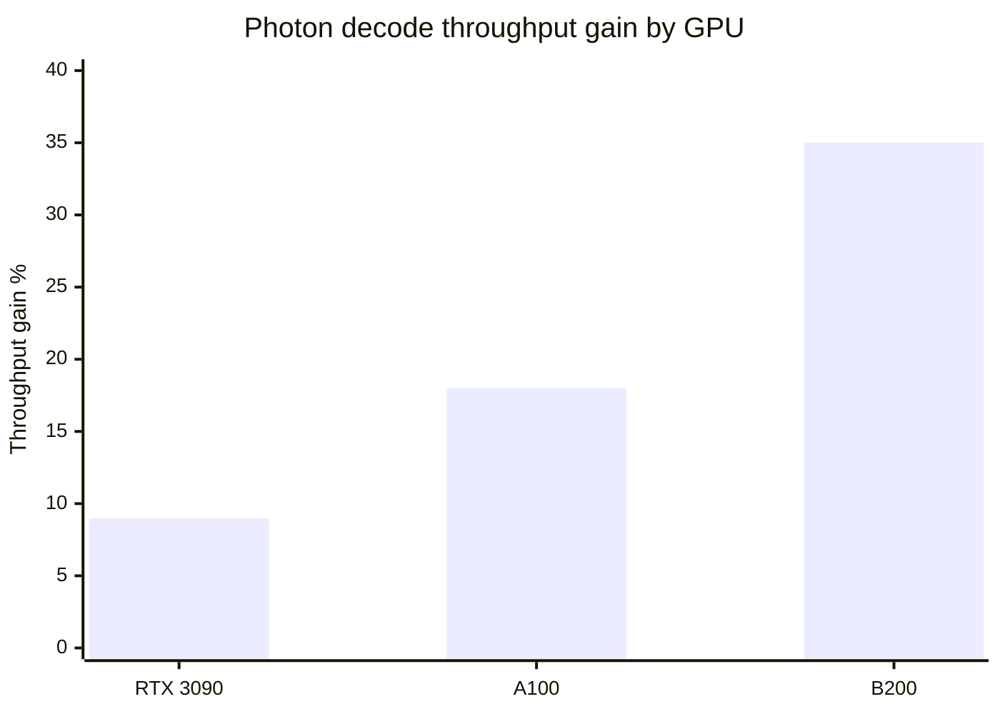

# Tools — 2026-06-30

## Moondream Photon: pipelined decoding removes GPU bubbles 

**Source:** [Moondream Blog](https://moondream.ai/blog/popping-the-gpu-bubble) · **Type:** release · **Time (UTC):** —

Moondream (M87 Labs) published the engineering design and released Photon, their inference engine built around pipelined decoding — a technique that eliminates "GPU bubbles," the idle GPU cycles that occur while the processor waits for CPU housekeeping between decode steps. Photon uses three mechanisms in combination:

1. **Ping-pong slots** — alternating memory buffers let the GPU begin step N+1 while the CPU processes step N output sampling.
2. **Forward-now, sample-later** — the forward pass for step N+1 is launched before sampling for step N completes, since the forward does not depend on the sampled token (except in constrained decoding).
3. **Zombie-sequence refcounting** — finished requests that remain in in-flight batches are managed by reference count rather than cancellation logic, avoiding synchronization stalls.

The throughput gain scales with hardware speed: 6–12% on RTX 3090, up to 35% on NVIDIA B200 at batch size 32.

**Why it matters:** CPU overhead as a share of total decode step time grows on faster GPUs — meaning the technique becomes more valuable as hardware improves, not less; the approach is architecture-agnostic and can be applied to any autoregressive inference engine.

---
