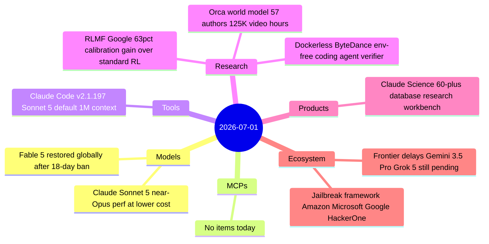

# AI Digest — 2026-07-01

> Q3 opens with Anthropic dominating the news cycle. Claude Sonnet 5 launched June 30 as the new default for Free and Pro users — approaching Opus 4.8 capability at a $2/$10-per-million-token introductory price — while Claude Science debuted as a research workbench integrating 60+ scientific databases. On July 1, Fable 5 and Mythos 5 were restored globally after the 18-day export ban was lifted, with a new safety classifier and a four-company industry jailbreak severity framework co-authored with Amazon, Microsoft, and Google. On the research side, Google published RLMF — a training-time approach to uncertainty calibration that shows a 63% improvement over standard RL — and ByteDance released Dockerless, an environment-free verifier for coding agents that could sharply reduce the infrastructure cost of training AI coders.

## Day at a glance



## Top stories

1. **Claude Sonnet 5 launches as new default model** — Anthropic's most capable Sonnet yet approaches Opus 4.8 on agentic tasks at $2/$10 per million tokens (introductory through August 31); also ships as default in Claude Code v2.1.197 with a native 1M-token context. [→ details](models.md#claude-sonnet-5)
2. **Fable 5 restored globally; Anthropic proposes industry jailbreak standard** — The 18-day export ban ends July 1 with a new safety classifier (>99% block rate), Opus 4.8 fallback, and a four-dimensional jailbreak severity framework developed with Amazon, Microsoft, and Google. [→ details](models.md#fable-5-restored)
3. **Claude Science launches as AI workbench for researchers** — Not a new model: an integration layer connecting 60+ scientific databases with genomics, chemistry, and protein-structure toolkits plus a dedicated citation fact-checker; beta on Pro+ plans with $30K grant credits available. [→ details](products.md#claude-science)

## By the numbers

| Category   | Items | Highlight |
|------------|------:|-----------|
| Models     |     2 | Sonnet 5: $2/$10 per M tokens intro, near-Opus 4.8 performance |
| MCPs       |     0 | — |
| Tools      |     1 | Claude Code v2.1.197: Sonnet 5 default, 1M-token context |
| Research   |     3 | RLMF: 63% calibration gain; Dockerless: 14.3 AUC over best open-source verifier |
| Products   |     1 | Claude Science: 60+ databases, $30K grant credits, apply by Jul 15 |
| Ecosystem  |     2 | Industry jailbreak framework; three major frontier models still pending |

## Timeline (UTC)

```mermaid
timeline
  title Releases and announcements
  Jun 30 00:01 : Claude Sonnet 5 launches as default Free and Pro model
               : Claude Science beta opens 60+ scientific databases
  Jun 30 ~18:00 : Fable 5 redeployment announced export controls lifted
  Jul 01 00:00 : Fable 5 live globally for all Claude users
               : Jailbreak severity framework proposed with Amazon Microsoft Google
```

## Files
- [Models](models.md)
- [MCPs](mcps.md)
- [Tools](tools.md)
- [Research](research.md)
- [Products](products.md)
- [Ecosystem](ecosystem.md)
