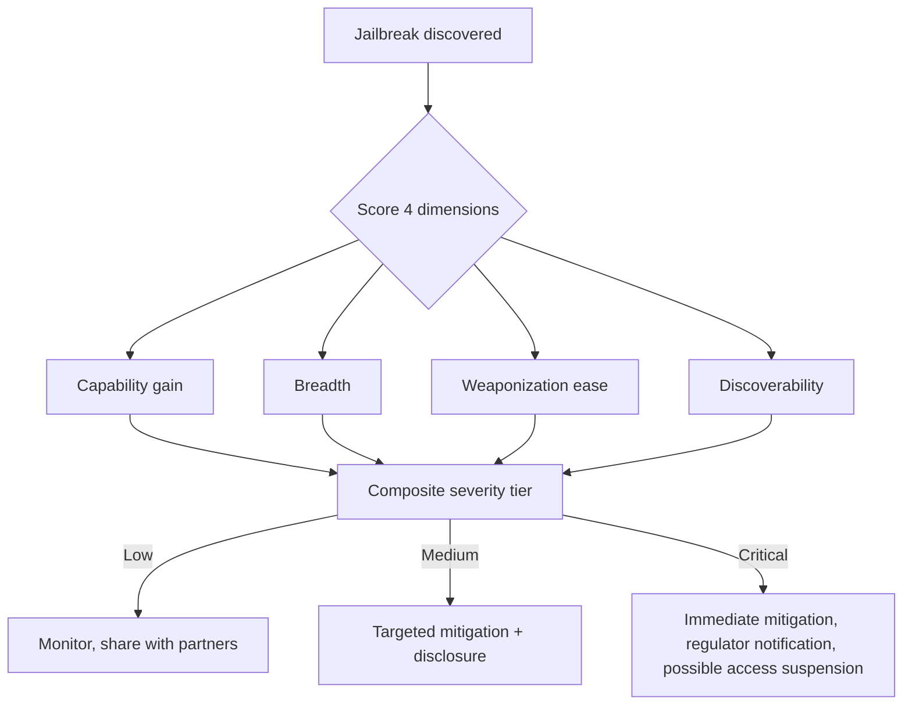

# Ecosystem — 2026-07-01

## Anthropic Proposes Industry Jailbreak Severity Framework 

**Source:** [Anthropic](https://www.anthropic.com/news/redeploying-fable-5) · **Type:** policy/safety · **Time (UTC):** Jul 01

Alongside the Fable 5 redeployment, Anthropic published a proposed four-dimensional framework for scoring AI model jailbreaks, co-developed with Amazon, Microsoft, Google, and unnamed Glasswing partners. The framework is designed to give regulators and model developers a shared vocabulary for assessing how dangerous a given jailbreak actually is — and to prevent export-control-style actions triggered by minor vulnerabilities.

The four scoring dimensions:

| Dimension | Low score when… | High score when… |
|-----------|-----------------|------------------|
| **Capability gain** | Existing tools reach the same outcome | The jailbreak unlocks genuinely novel offensive capability |
| **Breadth** | Only a narrow set of tasks are affected | The same technique works across many distinct attack types |
| **Weaponization ease** | Exploitation requires skilled, repeated prompting | The jailbreak is trivially deployable with minimal effort |
| **Discoverability** | Technique requires specialist knowledge to find | It is already documented and widely accessible online |

Anthropic also announced a new HackerOne bug bounty program for Fable 5 cyber jailbreaks, a 24-hour jailbreak monitoring team, pre-release model access for designated government security partners, and a commitment to notify government partners immediately when a high-severity jailbreak is confirmed.

**Why it matters:** The framework is a direct response to the ambiguity that allowed the June 12 export controls to be applied to a technique that — per Anthropic's own analysis and corroborating evidence against GPT-5.5 and Kimi K2.7 — did not uniquely expose Fable 5. If adopted industry-wide, the framework would create a precedent for proportionate regulatory responses to jailbreaks rather than blanket access bans.

---

## Frontier Access Ledger: Q3 Opens with Three Models Still Pending 

**Source:** Various (TechCrunch, CryptoBriefing, NxCode) · **Type:** update · **Time (UTC):** —

As Q3 opens, three major frontier models remain either delayed or access-restricted:

- **Grok 5** (xAI): Missed Q1 and Q2 targets; still in training on Colossus 2; no release date announced. The 6-trillion-parameter MoE model is one of the largest ever built; xAI's silence on timeline has persisted.
- **Gemini 3.5 Pro** (Google): Cleared for July but no confirmed date; still in limited enterprise preview. Google is refining coding, token efficiency, and long-task performance based on early tester feedback. Gemini 3.5 Flash is already generally available.
- **GPT-5.6 Sol/Terra/Luna** (OpenAI): Government-vetted preview access only; broader rollout (including Cerebras at up to 750 tokens/sec for Sol) said to be coming "in July." [Covered: June 27 digest.](../2026-06-27/models.md)

**Why it matters:** Fable 5's return partially relieves the frontier access drought covered over the past several digests, but Grok 5's persistent absence and Gemini 3.5 Pro's indefinite delay mean Anthropic's models face limited near-term competition at the absolute frontier of public access.

---
