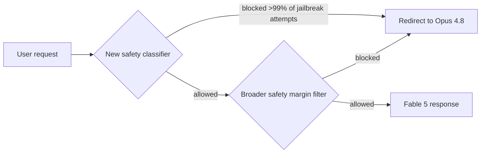

# Models — 2026-07-01

## Claude Sonnet 5 

**Source:** [Anthropic](https://www.anthropic.com/news/claude-sonnet-5) · **Type:** release · **Time (UTC):** Jun 30 ~00:01

Anthropic released Claude Sonnet 5 on June 30, making it the default model for all Claude Free and Pro users effective immediately. The model is positioned as the most capable Sonnet yet — closing most of the gap to Opus 4.8 on agentic tasks while costing significantly less. Sonnet 5 ships with a native 1-million-token context window, improved multi-step reasoning, stronger tool use (browser, terminal, code execution), and measurably lower hallucination and sycophancy rates than Sonnet 4.6. On agentic search (BrowseComp) and computer use (OSWorld-Verified) it matches some Opus 4.8 performance levels at medium-high effort configurations.

**Why it matters:** The price-performance shift makes sustained agentic workflows — those that previously required Opus to be reliable — economically practical for most developers. At $2 input / $10 output per million tokens through August 31, the introductory window is an especially low entry point.

| Tier | Input ($/M tokens) | Output ($/M tokens) | Effective through |
|------|--------------------|---------------------|-------------------|
| Introductory | $2.00 | $10.00 | Aug 31, 2026 |
| Standard | $3.00 | $15.00 | ongoing |

The model is accessible as `claude-sonnet-5` via the Claude API and is live in Claude Code (v2.1.197), Claude Cowork, and all Claude platform tiers (Free, Pro, Max, Team, Enterprise).

---

## Fable 5 and Mythos 5 Restored Globally 

**Source:** [Anthropic](https://www.anthropic.com/news/redeploying-fable-5) · **Type:** update · **Time (UTC):** Jul 01 00:00

Anthropic restored Fable 5 and Mythos 5 to all global users on July 1, ending an 18-day export control period that began June 12. The US Commerce Department lifted the export requirement on June 30 after Anthropic and government partners completed a joint review of the triggering jailbreak. Prior to full restoration, Mythos 5 had already been made available to US organizations on June 26.

Anthropic made three technical changes before redeployment:

1. **New safety classifier** — Trained specifically against the Amazon-reported technique; blocks it in over 99% of cases. When the classifier fires, the request is silently redirected to Claude Opus 4.8.
2. **Wider safety margin** — Fable 5's safety threshold was expanded, intentionally accepting some over-blocking of benign requests to shrink the window for harmful ones.
3. **Defense-in-depth stack** — Multiple independent mechanisms now apply in parallel so no single mitigation is a single point of failure.

Alongside the redeployment, Anthropic disclosed that testing confirmed the original technique could be replicated against GPT-5.5 and Kimi K2.7, arguing the capability was not uniquely exposed by Fable 5.

**Why it matters:** Fable 5 is Anthropic's most capable publicly available model; its absence for 18 days pushed many workloads to open-weight alternatives and competitors. Its return — with an industry jailbreak framework also proposed today (see [ecosystem.md](ecosystem.md#jailbreak-framework)) — sets a precedent for how US export control disputes over AI models get resolved.

---
