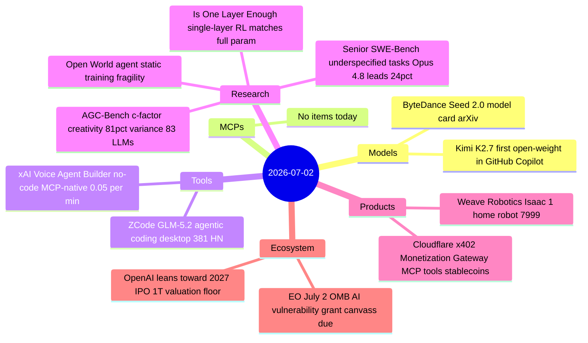
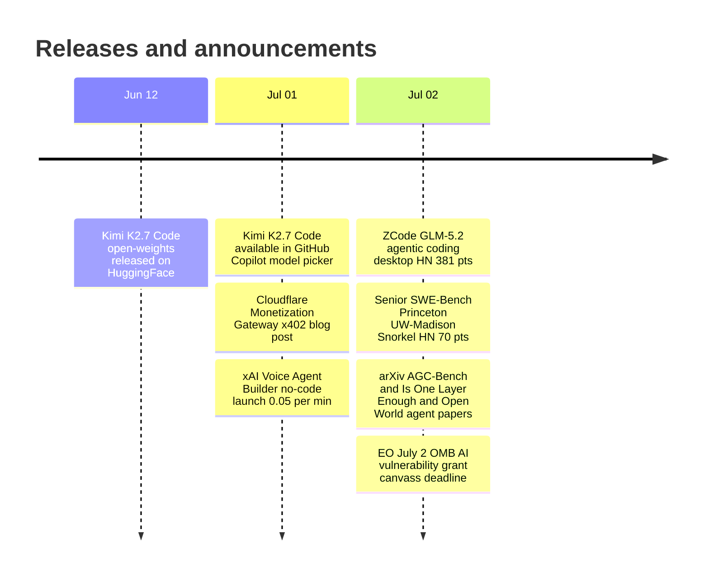

# AI Digest — 2026-07-02

> The day's signal story is ZCode (381 HN pts), a GLM-5.2-native desktop coding agent from z.ai that runs without Claude or GPT-5, reinforcing that open-weight Chinese models are ready for production engineering workflows. Cloudflare launched its Monetization Gateway (292 HN pts), wiring the x402 HTTP-payment protocol to APIs, datasets, and MCP tools via stablecoin micropayments — the first large-scale infrastructure play targeting the agentic internet's payment layer. On the research front, two new benchmarks fill evaluation gaps: Senior SWE-Bench stress-tests coding agents on deliberately underspecified tasks (top score: Claude Opus 4.8 at 24%), and AGC-Bench identifies a single 'c' creativity factor explaining 81.5% of performance variance across 83 LLMs. GitHub also became the first major coding platform to offer an open-weight model option, adding Kimi K2.7 Code to Copilot's model picker.

## Day at a glance

## Top stories

1. **ZCode: GLM-5.2-native agentic coding desktop app hits HN front page** — A no-Claude alternative coding environment from z.ai, combining multi-agent collaboration, a goals system for long-running tasks, and remote steering via WeChat/Feishu/Telegram; $16.20–$144/month depending on tier. [→ details](tools.md#zcode)
2. **Cloudflare Monetization Gateway: x402 stablecoin micropayments for APIs and MCP tools** — Any resource behind Cloudflare — REST endpoints, web pages, datasets, or MCP tool calls — can now carry per-request price tags settled in stablecoins, targeting the shift from human to agent internet traffic. [→ details](products.md#cloudflare-monetization-gateway)
3. **Kimi K2.7 Code lands in GitHub Copilot — first open-weight model in Copilot** — Moonshot AI's 1T-parameter MoE coding model (32B active) is now selectable in Copilot's model picker, hosted on Azure, at $0.95/MTok cache-miss input and $4/MTok output; admins must explicitly enable it for business/enterprise orgs. [→ details](models.md#kimi-k27-copilot)

## By the numbers

| Category   | Items | Highlight |
|------------|------:|-----------|
| Models     |     2 | Kimi K2.7 Code: first open-weight in GitHub Copilot |
| MCPs       |     0 | — |
| Tools      |     2 | ZCode: GLM-5.2 multi-agent coding, 381 HN pts |
| Research   |     4 | Senior SWE-Bench: Claude Opus 4.8 tops at 24% on underspecified tasks |
| Products   |     2 | Cloudflare x402 gateway: MCP tools, APIs, stablecoin pay-per-call |
| Ecosystem  |     2 | OpenAI leans 2027 IPO; EO July 2 OMB deadline passes |

## Timeline (UTC)

## Files
- [Models](models.md)
- [MCPs](mcps.md)
- [Tools](tools.md)
- [Research](research.md)
- [Products](products.md)
- [Ecosystem](ecosystem.md)
