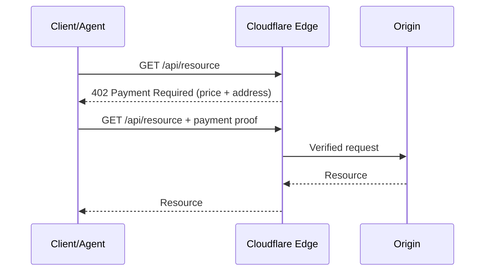

# Products — 2026-07-02

## Cloudflare Monetization Gateway 

**Source:** [blog.cloudflare.com/monetization-gateway](https://blog.cloudflare.com/monetization-gateway/) · **Type:** launch · **Time (UTC):** Jul 01 (292 HN pts)

Cloudflare opened a waitlist for its Monetization Gateway, a payment enforcement layer that runs at the network edge before requests reach origin servers. Any resource behind Cloudflare — REST API endpoints, web pages, datasets, or MCP tool calls — can now carry per-request price tags settled via the x402 protocol using stablecoins. The x402 exchange works as follows: a client requests a payment-gated resource; the server responds with HTTP 402 and a payload stating the price, accepted asset, and payment address; the client pays and retries the request with proof of payment; a facilitator verifies; the server returns the resource. The rules engine allows flexible pricing expressions: flat per-request fees, variable rates by complexity, or surcharges only for unauthenticated callers. Cloudflare has not announced its own fees for the gateway.

**Why it matters:** Agents have replaced humans as the dominant traffic source for many APIs, but ad-based and subscription-based monetization models both assume a human on the other end. x402 provides the missing payment primitive for per-call agent workflows, and Cloudflare's edge position means it can enforce payment before a single byte of origin compute is consumed. Explicitly listing MCP tool calls as a first-class resource type signals that Cloudflare views the agent protocol stack as a core infrastructure target.

---

## Weave Robotics Isaac 1 

**Source:** [weaverobotics.com/isaac-1](https://www.weaverobotics.com/isaac-1) · **Type:** launch · **Time (UTC):** Jul 02 (169 HN pts)

Weave Robotics announced Isaac 1, a mobile home robot priced at $7,999 (or $449/month), with California deliveries planned for fall 2026 and broader U.S. availability through 2027. Isaac 1 handles two main workflows: Laundry Flow (finding and collecting dirty clothes, managing hampers, and folding) and Daily Reset (returning rooms to a baseline ready state). The robot features a collapsible torso that extends to human height when working and retracts when idle. It is autonomous by default for both workflows but incorporates teleoperation assistance to guarantee task completion when the robot encounters situations it cannot handle independently.

**Why it matters:** The hybrid autonomy model — attempt full autonomy, fall back to teleoperation with a human in the loop — is a pragmatic approach to shipping home robots before full-autonomy problems are solved. At $7,999 it is cheaper than comparable offerings from Agility Robotics and Figure, though narrower in task scope.

---
