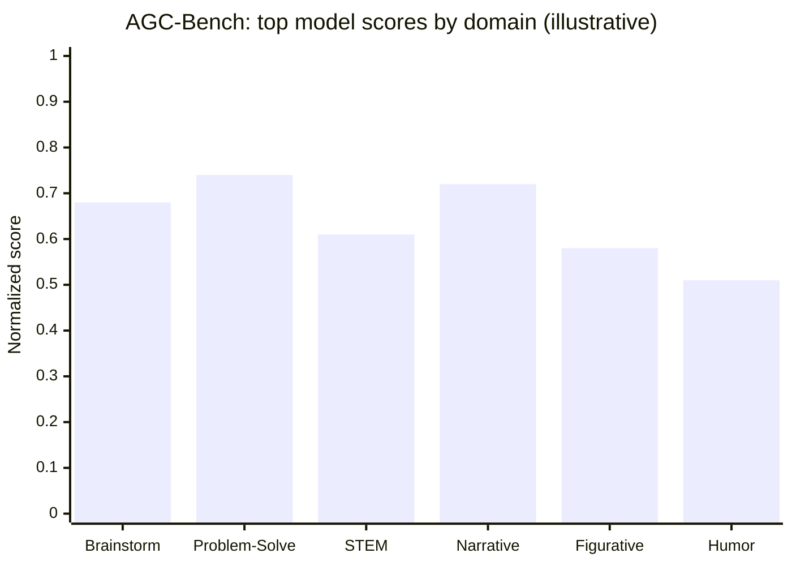
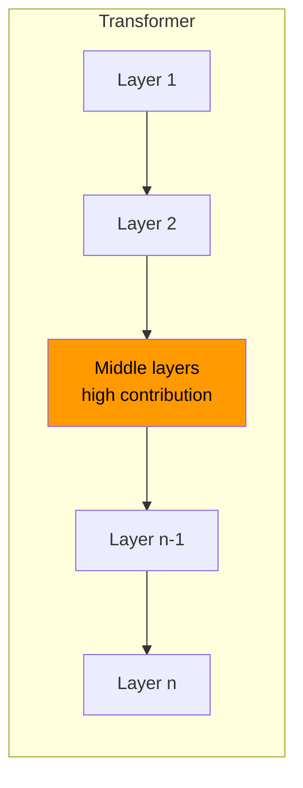

# Research — 2026-07-02

## Senior SWE-Bench: Harder, under-specified coding eval 

**Source:** [senior-swe-bench.snorkel.ai](https://senior-swe-bench.snorkel.ai/) · **Type:** benchmark · **Time (UTC):** Jul 02 (~70 HN pts)

Researchers from Princeton, UW–Madison, and Snorkel AI released Senior SWE-Bench, a coding agent evaluation designed around how senior engineers actually receive work — deliberately ambiguous descriptions, not ticket-style specifications. Task instructions have a median 31% shorter length than SWE-Bench Pro. Feature tasks touch an average of 11 files and span multiple services; bug tasks require runtime investigation from behavioral reports rather than stack traces. Scoring combines runtime correctness tests with code quality metrics inferred from observed codebase practices, penalizing agents that pass tests by brute-forcing special cases.

**Why it matters:** Pass rates on SWE-Bench Verified (now 70%+) and SWE-Bench Pro have started to look like benchmark saturation. Senior SWE-Bench resets the ceiling and surfaces a qualitatively different failure mode: agents that are good at narrow, over-specified tasks but can't navigate realistic ambiguity. The top score of 24% (Claude Opus 4.8) suggests there's a long road ahead for coding agents on real-world workflows.

| Model | Pass@1 |
|-------|-------:|
| Claude Opus 4.8 | 24.0% |
| Claude Sonnet 5 | 19.4% |
| GPT-5.5 | 16.0% |
| Claude Opus 4.7 | 14.1% |
| GPT-5.4 | 14.0% |

---

## AGC-Bench: A single creativity factor across 83 LLMs 

**Source:** [arXiv 2607.01152](https://arxiv.org/abs/2607.01152) · **Type:** paper · **Time (UTC):** Jul 02

Researchers assembled AGC-Bench (Artificial General Creativity Benchmark) by systematically reviewing 3,101 papers and 497 creativity-adjacent benchmarks, distilling the findings into 78 datasets across six domains: brainstorming, problem-solving, STEM, narrative, figurative language, and humor. They evaluate 83 LLMs and include AGC-Judge, a fine-tuned scoring model that accounts for judge bias using psychometric calibration. Three findings stand out: (1) A single latent factor 'c' explains 81.5% of the variance in creativity performance across all 83 models — structurally analogous to the general intelligence 'g' factor in humans, yet independent of general knowledge. (2) Prompting a model to "be creative" yields larger performance gains than enabling chain-of-thought or extended thinking. (3) Top-performing humans still outpace leading LLMs on creativity tasks under matched evaluation conditions.

**Why it matters:** The single-factor finding is theoretically important: it suggests creativity is not a bundle of independent skills but a unified latent capability that can be tracked with a scalar score. The "be creative" prompting result is immediately practical — cheap instruction engineering outperforms expensive reasoning mode for creative tasks.

---

## Can Agents Generalize to the Open World? 

**Source:** [arXiv 2607.01084](https://arxiv.org/abs/2607.01084) · **Type:** paper · **Time (UTC):** Jul 02

The paper formalizes "open-world generalization" for LLM-based agents as the ability to handle distributional shifts across four dimensions: queries (novel user intents), actions (new tools or APIs), observations (unexpected environment responses), and domains (entirely new task types). Both supervised fine-tuning and reinforcement learning approaches show significant performance degradation when any of these four dimensions shifts — even when shifts are small and controlled. The authors introduce Perturbation-Augmented Fine-Tuning, which intentionally exposes agents to noisy and perturbed versions of training scenarios to build robustness to realistic variation.

**Why it matters:** The benchmark gap between controlled agent evals and production deployment is well-known but not well-formalized. This paper provides a concrete taxonomy and shows that current best-practice training methods (SFT, RL) don't address the underlying problem. Perturbation-Augmented Fine-Tuning is a practical remedy applicable to any agentic training pipeline.

---

## Is One Layer Enough? RL gains concentrate in middle transformer layers 

**Source:** [arXiv 2607.01232](https://arxiv.org/abs/2607.01232) · **Type:** paper · **Time (UTC):** Jul 02

Testing GRPO, GiGPO, and Dr. GRPO across seven Qwen3 and Qwen2.5 models on math reasoning, code generation, and agentic decision tasks, the authors find that RL training gains are highly concentrated in a small subset of transformer layers — often just one or two — and that those layers are consistently in the middle of the network. They introduce a "layer contribution" metric to quantify this. Crucially, fine-tuning only the single highest-contribution layer recovers most, and in some cases all, of the gains from full-parameter RL training.

**Why it matters:** Full-parameter RL post-training is memory- and compute-intensive, especially for models beyond 70B. If the gains localize to 1–2 middle layers, selective layer fine-tuning becomes a viable strategy to reduce VRAM requirements and training time without meaningfully sacrificing performance — relevant to anyone running RL post-training on consumer or mid-tier hardware.

---
