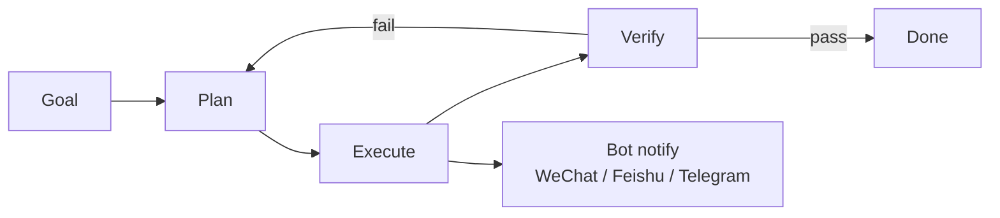

# Tools — 2026-07-02

## ZCode: GLM-5.2-native agentic coding desktop 

**Source:** [z.ai/en](https://zcode.z.ai/en) · **Type:** release · **Time (UTC):** ~Jul 02 (381 HN pts)

ZCode is a cross-platform desktop application (macOS, Windows, Linux) purpose-built around GLM-5.2 for agentic software engineering. Unlike Claude Code or Cursor, which layer an AI model on top of an existing editor, ZCode rebuilds the workflow around a goals system for long-running multi-step tasks: the agent plans, executes, verifies, and re-plans continuously until the goal is satisfied. Remote steering is available via WeChat, Feishu, or Telegram bots, letting engineers hand off background work and receive progress updates without an open terminal. The platform ships with 20+ coding tools with deep integration. Internally it uses Anthropic's Claude Agent SDK for orchestration scaffolding while routing inference through GLM-5.2 rather than Claude.

**Why it matters:** ZCode's HN reception (381 pts) is a data point that engineers are actively seeking Claude-independent agentic coding alternatives, particularly options built around open-weight or non-US-regulated models. Its use of the Claude Agent SDK for orchestration while swapping the underlying model underscores how the SDK abstraction layer is now separable from Claude itself.

| Plan | Price/month | Target |
|------|------------|--------|
| Lite | $16.20 | Small repos, light iteration |
| Pro | $64.80 | Mid-sized repos, 5× usage |
| Max | $144 | High volume, dedicated peak resources |

---

## xAI Voice Agent Builder 

**Source:** [x.ai/news/grok-voice-agent-builder](https://x.ai/news/grok-voice-agent-builder) · **Type:** release · **Time (UTC):** Jul 01

xAI launched a no-code Voice Agent Builder on July 1, enabling developers and non-engineers to assemble production-grade voice agents in under two minutes. The platform is powered by Grok Voice Think Fast 1.0 and offers 80+ preset voices alongside voice cloning from as little as two minutes of audio. It supports 25+ languages, claims sub-second latency for VoIP production environments, and bundles telephony provisioning, knowledge retrieval, tool dispatch, guardrails, native MCP server wiring, and observability in a single product. Users can also bring existing phone numbers over SIP or connect custom clients via WebSocket.

**Why it matters:** At $0.05/min for agents ($0.01/min extra for telephony), this is significantly below prevailing voice-AI pricing from ElevenLabs and equivalent services, and the native MCP integration makes it straightforward to connect voice agents to existing tool ecosystems without a separate API bridge.

| Feature | Detail |
|---------|--------|
| Base price | $0.05/min |
| Telephony | $0.01/min extra (provisioned numbers) |
| Voices | 80+ presets + voice cloning |
| Languages | 25+ |
| Latency | Sub-second (VoIP) |
| Native integrations | MCP servers, SIP, WebSocket |

---
