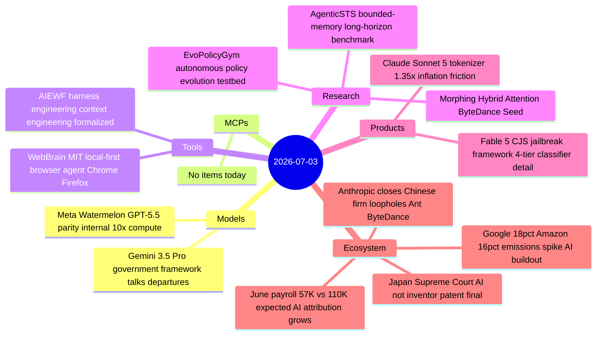

# AI Digest — 2026-07-03

> A post-holiday Friday with no major model launches from frontier labs, but dense policy and ecosystem news. The biggest story is Anthropic closing access loopholes used by Chinese firms — Ant Financial and ByteDance — who had been reaching Claude via cloud-provider accounts and overseas subsidiaries. Simultaneously, annual sustainability reports from Google (+18% GHG) and Amazon (+16% GHG) confirm that AI buildout is now the dominant driver of Big Tech's backsliding climate pledges. Meta's internal claim that "Watermelon" matches GPT-5.5 on benchmarks — at 10× Avocado's compute — keeps the training-scale arms race in view, while the AI Engineer World's Fair wrapped its four-day run formalizing "harness engineering" as a named discipline.

## Day at a glance



## Top stories

1. **Anthropic closes Chinese firm access loopholes** — Ant Financial and ByteDance were reaching Claude via Singapore entities and VPN-tunneled personal accounts; Anthropic is now working with AWS and Google Cloud to terminate these connections using latency-pattern telemetry. [→ details](ecosystem.md#anthropic-china-loopholes)
2. **Google and Amazon emissions surge: AI buildout now the dominant factor** — Google's annual GHG rose 18% (18.8 Mt CO₂e; +82% vs 2019 baseline); Amazon's rose 16% (80.85 Mt; +58% vs 2019); water consumption at Google climbed 34% to 10.9 billion gallons. [→ details](ecosystem.md#big-tech-emissions-ai)
3. **Meta "Watermelon" claims GPT-5.5 parity at 10× Avocado compute** — Alexandr Wang confirmed the benchmark claim internally; the model is still in training with no release date, and the specific benchmarks used were not disclosed. [→ details](models.md#meta-watermelon)

## By the numbers

| Category   | Items | Highlight |
|------------|------:|-----------|
| Models     |     2 | Watermelon: 10× Avocado compute, claims GPT-5.5-level internal benchmarks |
| MCPs       |     0 | — |
| Tools      |     2 | WebBrain: MIT, local-model-capable, read-only by default |
| Research   |     3 | AgenticSTS: bounded-memory benchmark for long-horizon agents |
| Products   |     2 | Fable 5 CJS: 5-level jailbreak severity, 4-tier classifier published |
| Ecosystem  |     4 | Anthropic China loophole closure; Google/Amazon emissions +18%/+16% |

## Timeline (UTC)

```mermaid
timeline
  title Releases & announcements
  00:00 : Meta Watermelon GPT-5.5 parity claim leaked
  09:00 : Anthropic Fable 5 safeguards and CJS framework post : Google Amazon emissions reports circulation
  12:00 : Anthropic Chinese firm loophole policy confirmed FT
  14:00 : WebBrain MIT browser agent trending
  18:00 : Japan AI patent ruling viral on HN 374pts
  All-day : AIEWF post-conference harness engineering coverage
```

## Files
- [Models](models.md)
- [MCPs](mcps.md)
- [Tools](tools.md)
- [Research](research.md)
- [Products](products.md)
- [Ecosystem](ecosystem.md)
