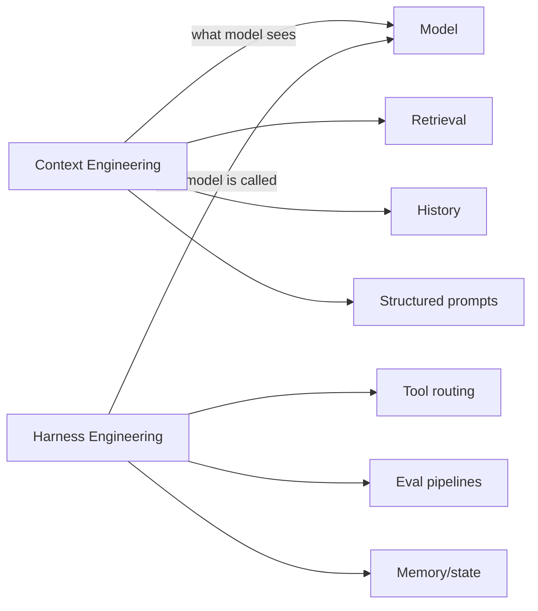

# Tools — 2026-07-03

## WebBrain: MIT-licensed local-first browser agent 

**Source:** [MarkTechPost](https://www.marktechpost.com/2026/07/02/meet-webbrain-an-open-source-local-first-ai-browser-agent-that-reads-pages-and-automates-tasks-in-chrome-and-firefox/) · **Type:** release · **Time (UTC):** ~14:00

WebBrain is a free, MIT-licensed browser extension for Chrome and Firefox that reads pages, extracts data, and automates multi-step tasks. Built by Emre Sokullu, it can run entirely against a local model (llama.cpp) so no page data leaves the machine, or connect to cloud APIs (OpenAI, Claude, OpenRouter) for more capability. The extension starts in read-only "Ask" mode and requires explicit user confirmation before consequential mutations; all create/send/submit/buy actions go through the visible UI rather than direct DOM manipulation. Available on Chrome Web Store, Firefox Add-ons, and [GitHub](https://github.com/esokullu/webbrain/).

**Why it matters:** Most browser-automation agents require a cloud LLM and send page HTML externally. WebBrain's local-model path and privacy-first mutation policy address the two main enterprise blockers (data egress and uncontrolled writes), making it the first open-weight-compatible browser agent suitable for restricted corporate environments.

---

## AIEWF 2026 concludes; "harness engineering" formalized as discipline 

**Source:** [AI Engineer World's Fair](https://www.ai.engineer/worldsfair/2026) · [Latent Space](https://www.latent.space/p/ainews-is-harness-engineering-real) · **Type:** event · **Time (UTC):** July 2 close

The AI Engineer World's Fair 2026 (June 29 – July 2, San Francisco, 6,000+ engineers, 300 speakers, 29 tracks) concluded its main-stage programming on July 2. The conference produced two terminology shifts likely to stick in production AI discourse:

- **Context engineering**: design of what information a model has access to — memory, retrieval, state, history.
- **Harness engineering**: the orchestration layer around a model — tooling, scaffolding, eval pipelines, and workflow systems — as a distinct engineering discipline rather than a prompt-engineering afterthought.

The consensus framing, surfaced in the Harness Engineering keynote and Latent Space's post-event coverage, positions the two as complementary: context engineering specifies the model's world; harness engineering specifies how that world is constructed and maintained at runtime. The conference also formalized "autoresearch" as a term for agents that conduct multi-step literature synthesis autonomously.

**Why it matters:** Terminology stabilization from a 6,000-person practitioner gathering tends to define how the field describes itself for the next 12–18 months. Teams that have been treating their orchestration layer as glue code now have a shared vocabulary — and job postings will follow.

---
