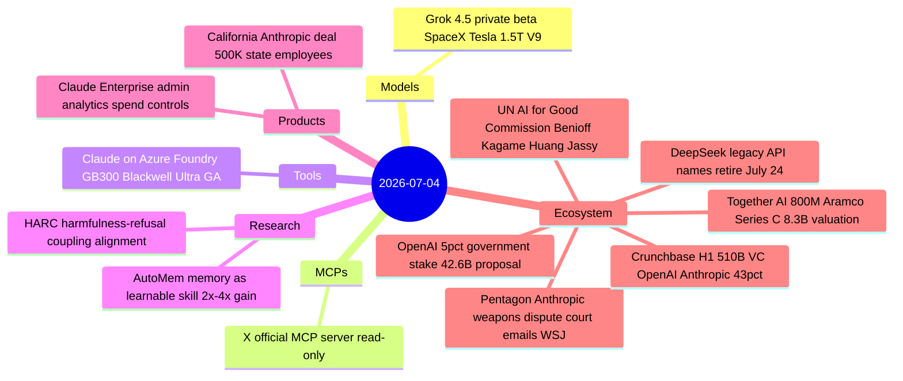
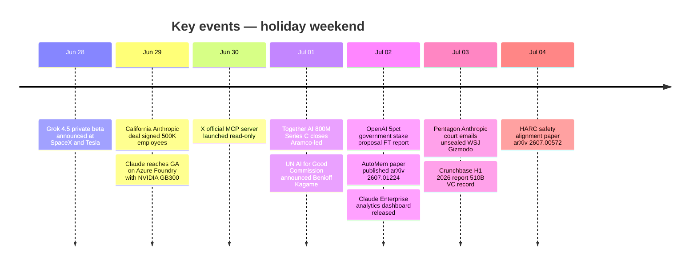

# AI Digest — 2026-07-04

> US Independence Day weekend was light on model launches but dense on policy and capital. The dominant story is the unsealing of court emails revealing that the Pentagon's dispute with Anthropic was specifically about autonomous weapons access — Dario Amodei drew two hard red lines (fully autonomous weapons and domestic mass surveillance) that Defense Undersecretary Emil Michael called "just not workable," triggering the federal retaliation that now sits in appeals court. Simultaneously, OpenAI pitched the Trump administration a 5% government equity stake worth ~$42.6B modeled on the Alaska Permanent Fund — a political risk-management move as much as an economic one. Infrastructure-side: Claude reached general availability on Azure Foundry running on NVIDIA GB300 Blackwell Ultra GPUs (50% cost reduction vs A100), xAI's 1.5T-parameter Grok 4.5 entered private beta at SpaceX and Tesla, and X launched its official hosted MCP server. Together AI closed an $800M Series C led by Saudi Aramco, and Crunchbase data shows OpenAI and Anthropic absorbed 43% of all global VC in H1 2026.

## Day at a glance

## Top stories

1. **Pentagon–Anthropic emails: autonomous weapons were the real fight** — Court-unsealed emails show Defense Undersecretary Emil Michael demanded Claude access without carve-outs for autonomous weapons; Amodei refused, triggering federal retaliation now in appeals court. The first concrete public record of how safety red lines collide with government procurement. [→ details](ecosystem.md#pentagon-anthropic-weapons)
2. **OpenAI proposes 5% US government equity stake worth ~$42.6B** — Altman pitched Commerce and Treasury a proposal modeled on the Alaska Permanent Fund; if adopted, it would align executive branch incentives with OpenAI's IPO outcome and potentially insulate the company from the kind of punitive action applied to Anthropic. [→ details](ecosystem.md#openai-government-stake)
3. **Together AI closes $800M Series C led by Saudi Aramco** — Open-source inference neocloud reaches $8.3B valuation; Aramco's involvement reflects Gulf sovereign capital betting against closed-model dependency; NVIDIA co-invests to secure GPU supply relationships. [→ details](ecosystem.md#together-ai-800m)

## By the numbers

| Category   | Items | Highlight |
|------------|------:|-----------|
| Models     |     1 | Grok 4.5: 1.5T params, private beta at SpaceX + Tesla, no public benchmarks |
| MCPs       |     1 | X hosted MCP: read-only platform access for AI assistants |
| Tools      |     1 | Claude on Azure Foundry: GB300 Blackwell Ultra, ~50% cost reduction |
| Research   |     2 | AutoMem: memory skill training yields 2×–4× long-horizon gains |
| Products   |     2 | California deal: largest US gov AI contract, 500K employees at 50% discount |
| Ecosystem  |     6 | Pentagon dispute; OpenAI stake; Together AI $800M; UN commission; Crunchbase H1; DeepSeek API sunset |

## Timeline (UTC)

## Files
- [Models](models.md)
- [MCPs](mcps.md)
- [Tools](tools.md)
- [Research](research.md)
- [Products](products.md)
- [Ecosystem](ecosystem.md)
