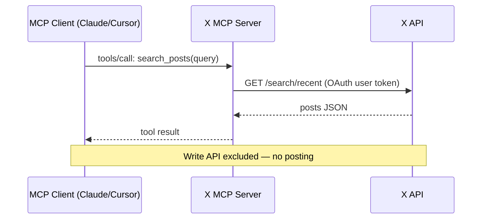

# MCPs — 2026-07-04

## X Launches Official Hosted MCP Server 

**Source:** [TechCrunch](https://techcrunch.com/2026/06/30/x-now-offers-an-mcp-server-to-make-its-platform-easier-for-ai-tools-to-use/) · **Type:** release · **Time (UTC):** Jun 30

X unveiled a production-ready hosted MCP server on June 30, allowing AI assistants — Claude, Cursor, Grok Build, and any other MCP-compatible client — to connect directly to the X platform using a user's own account credentials. The server exposes the existing X API surface: search posts, read timelines, look up profiles, and analyze conversations and trends. Critically, it does not expose the Write API, so agents cannot post, reply, or retweet autonomously. X joins GitHub, Slack, Notion, Stripe, and Salesforce as companies with official first-party MCP endpoints, describing its platform as "an information network filled with real-time data to retrieve and analyze."

**Why it matters:** Giving agents direct, authenticated access to X's real-time conversation graph expands the useful surface of agentic research and social-signal workflows without opening the door to automated posting abuse. The write-API exclusion is a deliberate guardrail that reflects lessons learned from the bot-spam era; whether it holds as agent adoption grows will be worth watching.

---
