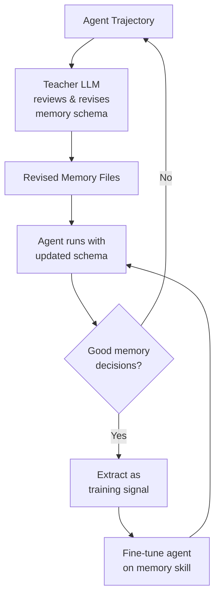

# Research — 2026-07-04

## AutoMem: Memory Management as a Learnable Cognitive Skill 

**Source:** [arXiv:2607.01224](https://arxiv.org/abs/2607.01224) · **Type:** paper · **Time (UTC):** Jul 02

AutoMem treats long-horizon agent memory not as a retrieval engineering problem but as a trainable cognitive skill — the agent learns *what* to encode, *when* to retrieve, and *how to organize* its knowledge files through two alternating training loops. In the outer loop, a stronger teacher LLM reviews complete agent trajectories and revises the memory schema. In the inner loop, the agent's own successful memory decisions are extracted as training signal to fine-tune the base policy. Experiments across three procedurally generated long-horizon games (Crafter, MiniHack, NetHack) show 2×–4× performance improvements from memory optimization alone, bringing a 32B open-weight base competitive with Claude Opus 4.5 and Gemini 3.1 Pro Thinking on these benchmarks.

**Why it matters:** The key finding is that memory proficiency is *independently learnable* and yields outsized gains — implying that inference-time memory-system design is a high-leverage optimization target separate from base model scale. For teams building production agents on open-weight models, AutoMem's training recipe offers a route to frontier-class long-horizon performance without frontier-class parameter counts.

---

## HARC: Coupling Harmfulness and Refusal Directions for Robust Safety Alignment 

**Source:** [arXiv:2607.00572](https://arxiv.org/abs/2607.00572) · **Type:** paper · **Time (UTC):** Jul 03

HARC (Harmfulness And Refusal Coupling) addresses a persistent fragility in RLHF safety alignment: learned refusal behaviors are often decoupled from the model's internal representation of harmfulness, making them vulnerable to activation-steering and soft-prompt jailbreaks that shift the refusal direction without touching the harm representation. The paper jointly constrains both directions during fine-tuning, using a geometric coupling objective that penalizes divergence between the harmfulness and refusal subspaces in the model's residual stream. The authors report improved robustness against seven jailbreak families while maintaining helpfulness on standard benchmarks.

**Why it matters:** Most current safety evaluation frameworks measure output refusal rates, not the underlying geometric relationship between harm and refusal representations. HARC's approach points toward a more structurally robust alignment target and provides a concrete diagnostic for evaluating whether a model's safety training has coupled correctly — relevant both for evaluators and for red-teamers designing the next generation of attacks.

---
