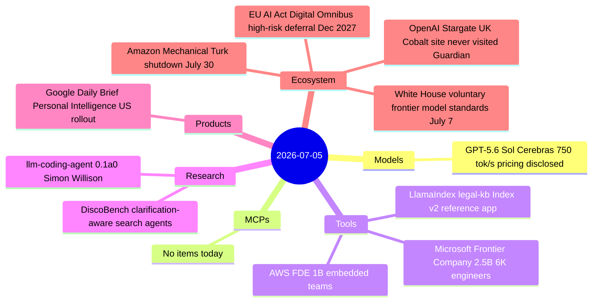
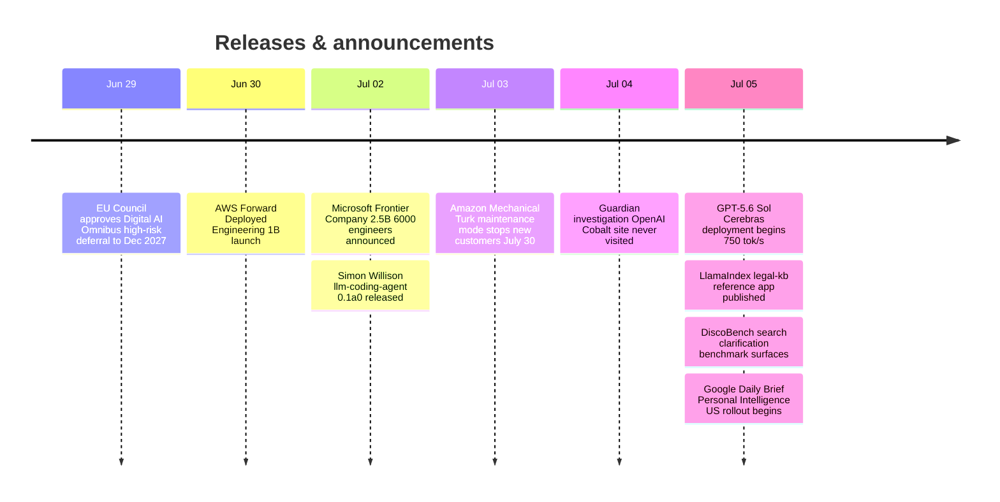

# AI Digest — 2026-07-05

> The day's most symbolic event is Amazon's wind-down of Mechanical Turk — a 21-year-old platform where humans labeled data for AI — as the function it served is now largely automated by the models it helped train. The structural story of the week is the simultaneous birth of three large forward-deployed engineering organizations: AWS ($1B, June 30), Microsoft Frontier Company ($2.5B, July 2), and earlier launches from OpenAI and Anthropic, representing a collective $3.5B+ bet that enterprise AI's next bottleneck is implementation, not capability. On the policy front, the EU's Digital AI Omnibus cleared final Council approval, pushing the high-risk AI compliance deadline from August 2026 to December 2027; and the White House is expected to announce a voluntary frontier-model standards framework as early as next week.

## Day at a glance

## Top stories

1. **Amazon Mechanical Turk closes to new customers (July 30)** — The 21-year platform for human microtasking enters maintenance mode; AI-native labeling pipelines have displaced the core use case. A direct signal that the data-annotation labor market has structurally shifted. [→ details](ecosystem.md#mechanical-turk-shutdown)
2. **Microsoft + AWS launch $3.5B+ in forward-deployed AI engineering** — Microsoft Frontier Company ($2.5B, July 2) and AWS Forward Deployed Engineering ($1B, June 30) both embed engineers directly inside enterprise customers, matching moves already made by OpenAI and Anthropic. The AI deployment services market is now a hyperscaler battleground. [→ details](tools.md#microsoft-frontier-company)
3. **EU AI Act Digital Omnibus defers high-risk deadline 16 months** — High-risk AI systems (Annex III) now have until December 2027 rather than August 2026; the amendment clears its final legislative hurdle and awaits official journal publication. [→ details](ecosystem.md#eu-ai-act-omnibus)

## By the numbers

| Category   | Items | Highlight |
|------------|------:|-----------|
| Models     |     1 | GPT-5.6 Sol: $5/$30 per MTok, 750 tok/s on Cerebras |
| MCPs       |     0 | — |
| Tools      |     3 | Microsoft Frontier Co. + AWS FDE = $3.5B in embedded AI deployment |
| Research   |     2 | DiscoBench: clarification-aware search agents across 11 domains |
| Products   |     1 | Google Daily Brief + Personal Intelligence rolling out to US AI subscribers |
| Ecosystem  |     4 | MTurk wind-down; EU Act deferral; Stargate UK scrutiny; White House standards |

## Timeline (UTC)

## Files
- [Models](models.md)
- [MCPs](mcps.md)
- [Tools](tools.md)
- [Research](research.md)
- [Products](products.md)
- [Ecosystem](ecosystem.md)
